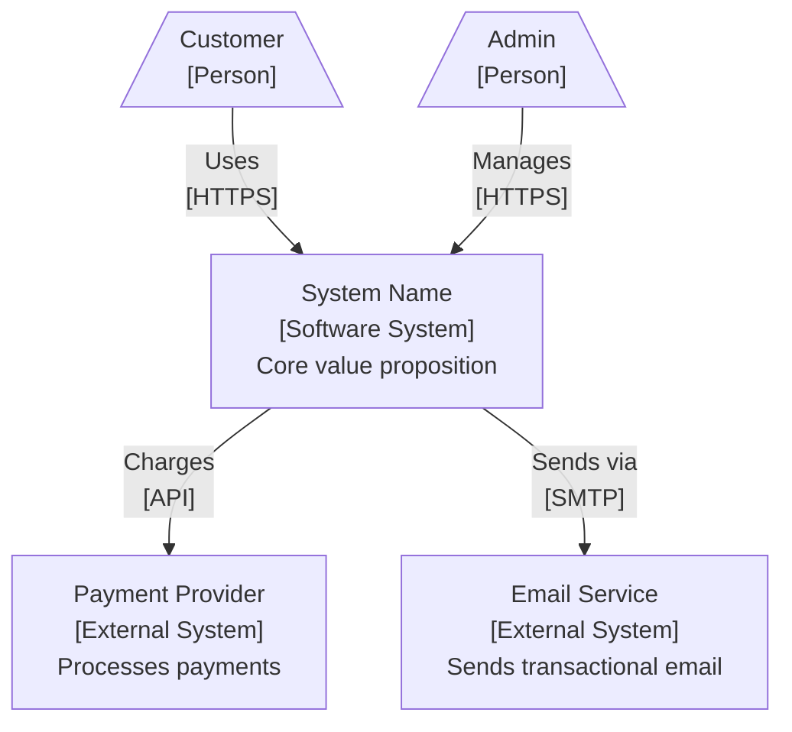
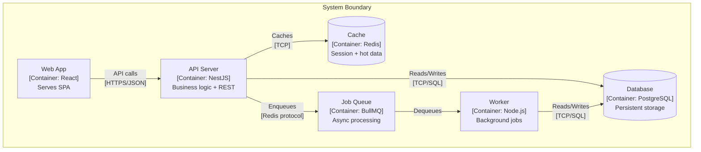
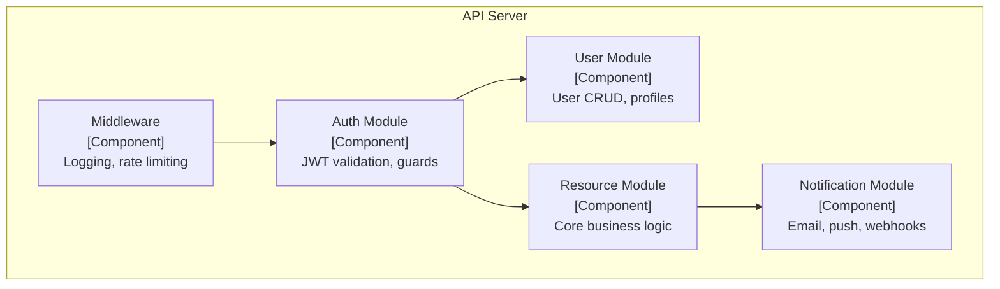
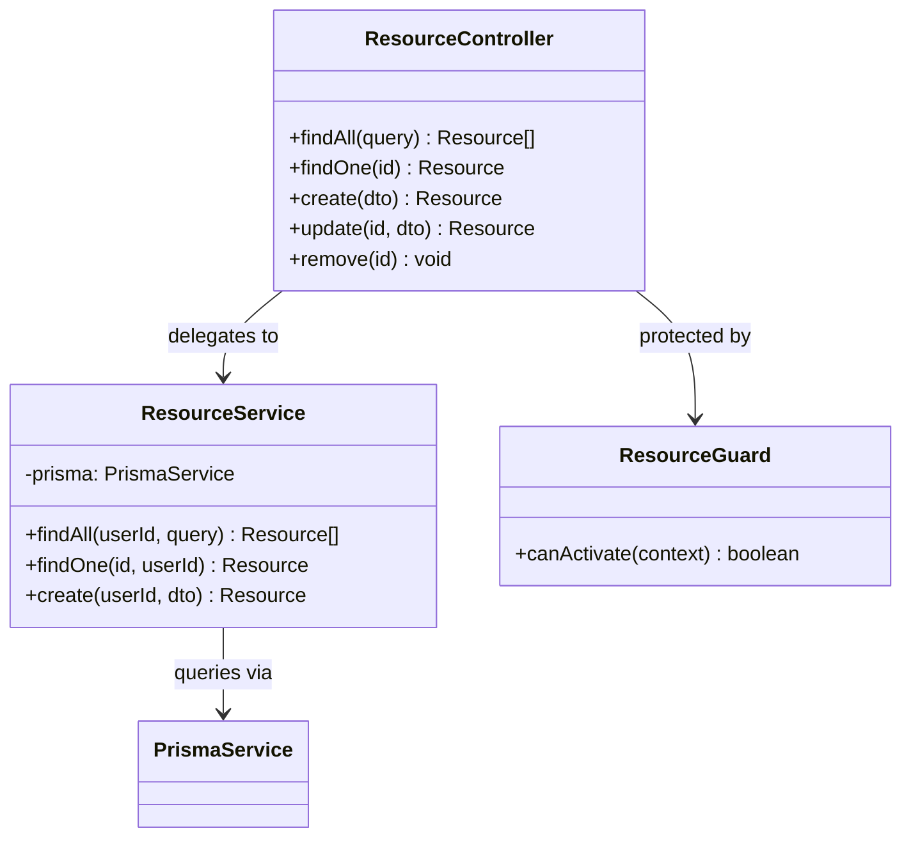

# C4 Architecture Diagrams Skill

**Purpose**: Produces architecture diagrams at all four C4 model levels (Context, Container, Component, Code) in Mermaid syntax. Each level targets a different audience and zoom level, ensuring that executives, architects, and developers all have an appropriate view of the system.

## TRIGGER COMMANDS

```text
"Create C4 diagrams for [system]"
"Generate architecture diagrams"
"C4 context diagram"
```

## When to Use
- After ARA (Atomic Reverse Architecture) has decomposed the system
- When onboarding new team members who need architecture orientation
- Before design reviews or architecture sign-off
- When communicating system design to non-technical stakeholders

---

## PROCESS

### Step 1: Level 1 -- System Context Diagram

**Audience**: Everyone (executives, PMs, developers, auditors)
**Shows**: The system as a single box, its users, and external dependencies



**Rules**:
- System under design is ONE box in the center
- All external actors (people, systems) surround it
- Label every arrow with verb + protocol
- No internal details -- this is the 30,000-foot view

### Step 2: Level 2 -- Container Diagram

**Audience**: Architects and senior developers
**Shows**: Runtime containers (applications, databases, queues) within the system boundary



**Rules**:
- Each box is a separately deployable/runnable unit
- Include technology choice in brackets
- Show inter-container communication with protocol
- Stay within the system boundary established in Level 1

### Step 3: Level 3 -- Component Diagram

**Audience**: Developers working on a specific container
**Shows**: Internal modules/components within ONE container (typically the API server)



**Rules**:
- Pick ONE container to decompose (usually the most complex)
- Each component maps to a module, service, or bounded context
- Show dependency direction (who calls whom)
- Include only architecturally significant components, not every file

### Step 4: Level 4 -- Code Diagram (Selective)

**Audience**: Developers modifying a specific component
**Shows**: Key classes, interfaces, or functions within ONE component



**Rules**:
- Only create Level 4 for components with complex internal structure
- Use class diagrams or sequence diagrams as appropriate
- This level is optional for simpler components
- Keep it focused -- 3-6 classes maximum per diagram

### Step 5: Compile and Document

Assemble all diagrams into a single document with navigation:

```markdown
# C4 Architecture Diagrams -- [System Name]
**Date**: YYYY-MM-DD

## Diagram Index
| Level | Name | Audience | Link |
|-------|------|----------|------|
| L1 | System Context | Everyone | [Jump](#level-1) |
| L2 | Containers | Architects | [Jump](#level-2) |
| L3 | Components: API | Developers | [Jump](#level-3) |
| L4 | Code: ResourceModule | Developers | [Jump](#level-4) |
```

---

## OUTPUT

**Path**: `.agent/docs/2-design/c4-architecture-diagrams.md`

---

## CHECKLIST

- [ ] Level 1 Context diagram shows system, users, and external systems
- [ ] Level 2 Container diagram shows all runtime units with technology labels
- [ ] Level 3 Component diagram decomposes the primary container
- [ ] Level 4 Code diagram produced for at least one complex component (if warranted)
- [ ] Every arrow is labeled with verb and protocol/mechanism
- [ ] All diagrams use Mermaid syntax for version-control friendliness
- [ ] Audience guidance included per level
- [ ] Diagram index provides navigation across levels
- [ ] Diagrams are consistent with ARA decomposition

---

*Skill Version: 1.0 | Phase: 2-Design | Priority: P1*
