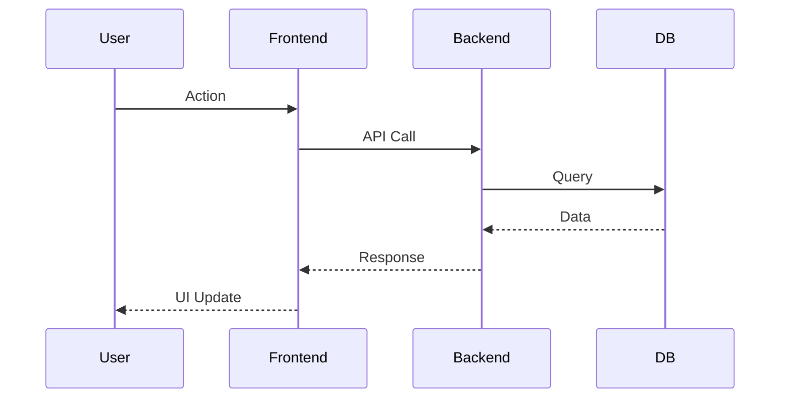
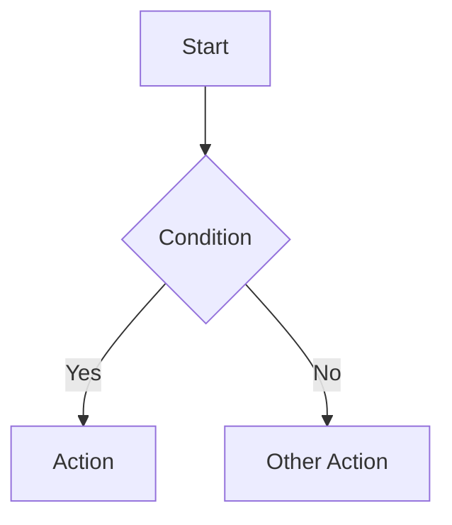

# Feature Architecture Documentation Skill

**Purpose**: Create a complete reference document for any complex feature in the codebase. These documents serve as the single source of truth for understanding, maintaining, and extending features.

> [!CAUTION]
> **APPEND-ONLY RULE**: When updating architecture documents, ALWAYS ADD new sections at the end. NEVER DELETE existing documentation. If architecture changes, add a new section with the updated information and mark old sections with `[SUPERSEDED BY: Section X]`.

---

## 🎯 TRIGGER COMMANDS

Use any of these phrases to activate this skill:

```text
"Document the [feature name] architecture"
"Create architecture docs for [feature]"
"I need technical documentation for [feature]"
"Using feature_architecture skill: document [feature]"
```

---

## 📋 WHEN TO USE

Create an architecture document when:

1. **Feature is complex** - Spans multiple files, tables, or components
2. **Feature has many touchpoints** - Interacts with multiple other features
3. **Feature is hard to understand** - Requires context to modify safely
4. **Feature is frequently modified** - Reference docs reduce errors
5. **Feature is critical** - Important enough to warrant comprehensive docs

---

## 📄 OUTPUT LOCATION

**Path**: `.agent/docs/2-design/[feature-name]-architecture.md`

**Naming**: Use kebab-case feature names, e.g.:

- `onboarding-context-layer-architecture.md`
- `crm-contacts-architecture.md`
- `automation-workflow-architecture.md`

---

## 📝 DOCUMENT STRUCTURE

Use this template for all feature architecture documents:

```markdown
# [Feature Name] System Architecture

**Document ID**: ARCH-[CODE]-001  
**Last Updated**: [Date]  
**Purpose**: Complete reference for [feature description]

---

## 📋 System Overview

[2-3 sentences describing what the feature does and why it exists]

### User Journey Flow



---

## 🗄️ Database Architecture

### Tables

| Table | Purpose | Key Columns |
|-------|---------|-------------|
| `table_name` | [what it stores] | [important columns] |

### Row-Level Security (RLS)

[Document any RLS policies]

---

## 🎓 University Heist Analysis (Theory)

### 1. Big O Analysis

- **Time Complexity**: O(n) for list retrieval? O(1) for lookup?

- **Space Complexity**: Are we caching large datasets?

### 2. Concurrency & Race Conditions

- **Race Risks**: What if two users edit [X] at once?

- **Locking**: Optimistic vs. Pessimistic locking needed?

---

## 📝 Data Model

### [Entity Name 1]

**Purpose**: [What this data represents]

| Field | Type | Description |
|-------|------|-------------|
| field_name | type | [description] |

[Repeat for each major entity]

---

## 🔌 Backend API Endpoints

### [Category 1]

| Method | Endpoint | Purpose |
|--------|----------|---------|
| GET | `/api/...` | [description] |

[Group endpoints by category]

---

## 🖥️ Frontend Components

### [Component Group]

**Location**: `frontend/src/components/[path]/`

| Component | Route | Purpose |
|-----------|-------|---------|
| `Name.tsx` | /route | [description] |

---

## 🔄 Data Flow

### [Flow Name]



---

## 📂 Key Files Reference

### Backend

```text
backend/src/[module]/
├── module.ts         # [description]
├── controller.ts     # [description]
└── service.ts        # [description]
```

### Frontend

```text
frontend/src/
├── components/
│   └── [feature]/
│       └── Component.tsx
└── pages/
    └── Page.tsx
```

---

## 🔧 How to Modify

### [Common Modification 1]

1. Step one
2. Step two
3. Step three

### [Common Modification 2]

[Repeat for each common modification pattern]

---

## 🔗 Feature Interactions

### Upstream Dependencies (What This Feature Needs)

| Dependency | Purpose | Notes |
|------------|---------|-------|
| **Dependency Name** | [why needed] | [implementation notes] |

### Downstream Consumers (What Uses This Feature)

| Feature | How It Uses This | Integration Point |
|---------|------------------|-------------------|
| **Consumer Name** | [description] | [API/table/event] |

### Data Contracts

```typescript
// Interface definitions consumed by other features
interface OutputType {
  field: type;
}
```

### Event Hooks (Future/Planned)

| Event | Trigger | Potential Consumers |
|-------|---------|---------------------|
| `feature.action` | [when triggered] | [who might use it] |

---

## 🔐 Security Considerations

1. **[Consideration 1]** - [description]
2. **[Consideration 2]** - [description]

---

## 📝 Future Enhancements

1. **[Enhancement 1]** - [description]
2. **[Enhancement 2]** - [description]

```

---

## 🔍 INFORMATION GATHERING CHECKLIST

Before writing the document, gather this information:

### Backend Investigation

- [ ] List all database tables involved
- [ ] Count API endpoints and group by function
- [ ] Identify the main service file(s)
- [ ] Find raw SQL queries or Prisma models
- [ ] Check for any middleware or guards

### Frontend Investigation

- [ ] List all page components
- [ ] List all reusable components
- [ ] Identify the routes in App.tsx
- [ ] Find any shared hooks or utilities
- [ ] Check for any context providers

### Integration Investigation

- [ ] What other features depend on this?
- [ ] What does this feature depend on?
- [ ] What data contracts exist?
- [ ] Are there any event emissions/subscriptions?

---

## 💡 TIPS FOR QUALITY DOCS

1. **Use Mermaid.js** - Create `sequenceDiagram` for flows and `graph TD` for logic.
2. **Count accurately** - Verify numbers (endpoints, questions, tables) from source code
3. **Group related items** - Use tables and categories to organize
4. **Show file paths** - Exact locations help developers find code
5. **Include examples** - Show actual interface definitions when possible
6. **Link to source** - Reference the actual code structure
7. **Think about modifications** - What will someone need to change?
8. **Document interactions** - Features rarely exist in isolation
9. **University Heist** - Always check Big O and Race Conditions.

---

## ✅ EXIT CHECKLIST

Before marking the document complete:

- [ ] Document ID and date are set
- [ ] System overview explains the purpose
- [ ] User journey flow is accurate
- [ ] All database tables are listed
- [ ] All API endpoints are documented
- [ ] All frontend components are referenced
- [ ] Data flow is explained
- [ ] Key files are listed with correct paths
- [ ] Modification guides cover common changes
- [ ] Feature interactions are documented
- [ ] Security considerations are noted
- [ ] Saved to `.agent/docs/2-design/[feature]-architecture.md`
- [ ] Committed to git

---

*Skill Version: 1.0 | Created: January 2026*
