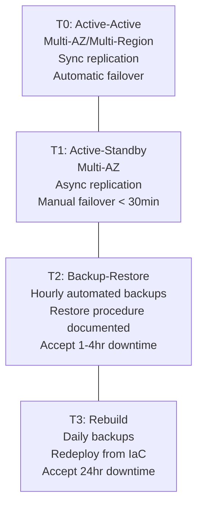

# RTO/RPO Design Skill

**Purpose**: Captures and documents Recovery Time Objective (RTO) and Recovery Point Objective (RPO) requirements during the design phase. Produces a DR requirements document that becomes the authoritative reference for Phase 5.5 backup strategy, Phase 6 disaster recovery, and Phase 7 incident response operations.

## TRIGGER COMMANDS

```text
"Define RTO and RPO"
"Disaster recovery requirements"
"Business continuity requirements"
```

## When to Use
- During Phase 2 design for any production system
- When SLA commitments require documented recovery guarantees
- Before selecting backup strategies, replication topologies, or DR tooling
- When the system handles financial transactions, health data, or legal records

---

## PROCESS

### Step 1: Classify Services into Tiers

Not all services need the same recovery guarantees. Classify each service by business impact:

```markdown
## Service Tier Classification

| Tier | Name | Description | Example Services |
|------|------|-------------|-----------------|
| T0 | Critical | Revenue stops, legal exposure | Payment processing, auth |
| T1 | High | Major user impact, workarounds exist | Core API, primary database |
| T2 | Standard | Degraded experience, not blocking | Search, recommendations, analytics |
| T3 | Low | Minimal impact, deferrable | Admin dashboards, batch reports |
```

### Step 2: Define RTO and RPO Per Tier

```markdown
## Recovery Objectives

| Tier | RTO | RPO | Justification |
|------|-----|-----|---------------|
| T0 - Critical | < 5 minutes | 0 (zero data loss) | Synchronous replication, auto-failover |
| T1 - High | < 30 minutes | < 5 minutes | Async replication, manual failover |
| T2 - Standard | < 4 hours | < 1 hour | Hourly backups, restore from backup |
| T3 - Low | < 24 hours | < 24 hours | Daily backups, rebuild if needed |
```

**Key definitions**:
- **RTO (Recovery Time Objective)**: Maximum acceptable time from failure to service restoration
- **RPO (Recovery Point Objective)**: Maximum acceptable data loss measured in time (e.g., "5 minutes" means you can lose the last 5 minutes of data)

### Step 3: Map Services to Tiers

Assign every system service to a tier:

```markdown
## Service-to-Tier Mapping

| Service | Tier | RTO | RPO | Recovery Strategy |
|---------|------|-----|-----|-------------------|
| Auth Service | T0 | 5 min | 0 | Multi-AZ active-active |
| Payment Service | T0 | 5 min | 0 | Multi-AZ + transaction log |
| Core API | T1 | 30 min | 5 min | Multi-AZ standby, async replication |
| PostgreSQL Primary | T1 | 30 min | 5 min | Streaming replica + WAL archiving |
| Redis Cache | T2 | 4 hr | N/A | Rebuild from DB (cache is ephemeral) |
| Search Index | T2 | 4 hr | 1 hr | Reindex from primary DB |
| Admin Panel | T3 | 24 hr | 24 hr | Redeploy from container image |
| Batch Reports | T3 | 24 hr | 24 hr | Re-run from source data |
```

### Step 4: Define Recovery Strategy Per Tier



### Step 5: Document Recovery Validation Requirements

For each tier, specify how recovery capability will be verified:

| Tier | Validation Method | Frequency | Owner |
|------|------------------|-----------|-------|
| T0 | Automated failover test (chaos engineering) | Monthly | SRE |
| T1 | Manual failover drill | Quarterly | SRE |
| T2 | Backup restore test | Quarterly | DevOps |
| T3 | IaC redeploy test | Semi-annually | DevOps |

---

## OUTPUT

**Path**: `.agent/docs/2-design/rto-rpo-design.md`

---

## CHECKLIST

- [ ] All services classified into tiers (T0-T3)
- [ ] RTO and RPO defined per tier with justification
- [ ] Every production service mapped to a tier
- [ ] Recovery strategy specified per tier (active-active, standby, backup, rebuild)
- [ ] Ephemeral services (caches) explicitly marked as rebuildable
- [ ] Recovery validation schedule defined per tier
- [ ] Downstream phase references documented (Phase 5.5, 6, 7)
- [ ] Stakeholder sign-off on RTO/RPO targets obtained
- [ ] Cost implications of recovery strategies noted

---

*Skill Version: 1.0 | Phase: 2-Design | Priority: P1*
