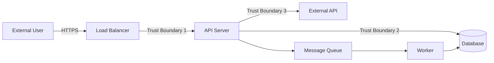

# Security Threat Modeling Skill

**Purpose**: Conducts a structured threat modeling session against the system architecture, producing a prioritized Threat Register with concrete mitigations. The output becomes the baseline for Phase 4 security audits and penetration testing scope.

## TRIGGER COMMANDS

```text
"Threat model for [system]"
"Run STRIDE analysis"
"Identify security threats"
```

## When to Use
- After ARA (Atomic Reverse Architecture) produces the system decomposition
- Before finalizing API contracts or data models
- When adding external integrations, auth flows, or payment processing
- For compliance-driven systems requiring documented threat analysis (SOC2, ISO 27001)

---

## PROCESS

### Step 1: Draw the Data Flow Diagram (DFD)

Produce a DFD from the ARA output identifying these elements:



Identify and label:
- **External entities**: Users, third-party services, webhooks
- **Processes**: API servers, workers, schedulers
- **Data stores**: Databases, caches, file storage, queues
- **Data flows**: Every arrow with protocol and data type
- **Trust boundaries**: Every point where privilege level changes

### Step 2: Enumerate Threats Using STRIDE

For EACH trust boundary crossing, apply the STRIDE categories:

| Category | Threat Question | Example |
|----------|----------------|---------|
| **S**poofing | Can an attacker impersonate a legitimate entity? | Forged JWT, stolen API key |
| **T**ampering | Can data be modified in transit or at rest? | Man-in-the-middle, SQL injection |
| **R**epudiation | Can a user deny performing an action? | Missing audit logs |
| **I**nformation Disclosure | Can sensitive data leak? | Error stack traces, verbose logs |
| **D**enial of Service | Can the service be overwhelmed? | Unbounded queries, missing rate limits |
| **E**levation of Privilege | Can a user gain unauthorized access? | IDOR, broken access control |

### Step 3: Score Each Threat Using DREAD

Rate each identified threat on a 1-10 scale across five dimensions:

| Dimension | Question | Low (1-3) | Medium (4-6) | High (7-10) |
|-----------|----------|-----------|--------------|-------------|
| **D**amage | How bad if exploited? | Minor data | PII exposure | Full breach |
| **R**eproducibility | How easy to reproduce? | Complex chain | Specific conditions | Every time |
| **E**xploitability | How easy to exploit? | Expert + tools | Moderate skill | Script kiddie |
| **A**ffected Users | How many impacted? | Single user | Subset | All users |
| **D**iscoverability | How easy to find? | Deep internals | With effort | Obvious |

**DREAD Score** = (D + R + E + A + D) / 5. Prioritize mitigations for scores above 7.

### Step 4: Define Mitigations

For each threat scoring above the threshold, specify a concrete mitigation:

```markdown
### THREAT-007: IDOR on /api/documents/:id
- **STRIDE Category**: Elevation of Privilege
- **DREAD Score**: 8.2
- **Attack**: User A changes document ID to access User B's documents
- **Mitigation**: Add ownership check in DocumentService.findOne()
  verifying `document.ownerId === currentUser.sub`
- **Validation**: Phase 4 integration test with cross-user ID swap
- **Status**: Open
```

### Step 5: Produce Threat Register

Compile all threats into the final register:

```markdown
# Threat Register
**System**: [system name]
**Date**: YYYY-MM-DD
**Methodology**: STRIDE + DREAD

## Summary
- Total threats identified: [N]
- Critical (DREAD > 7): [N]
- High (DREAD 5-7): [N]
- Low (DREAD < 5): [N]

## Threat Table
| ID | Category | Threat | DREAD | Mitigation | Owner | Status |
|----|----------|--------|-------|------------|-------|--------|
| T-001 | Spoofing | ... | 8.4 | ... | ... | Open |
```

---

## OUTPUT

**Path**: `.agent/docs/2-design/threat-register.md`
**DFD**: `.agent/docs/2-design/threat-model-dfd.md`

---

## CHECKLIST

- [ ] DFD drawn from ARA output with all trust boundaries labeled
- [ ] STRIDE applied to every trust boundary crossing
- [ ] Each threat scored with DREAD (5 dimensions, 1-10 scale)
- [ ] All threats with DREAD > 7 have concrete mitigations
- [ ] Mitigations specify implementation location (file/function)
- [ ] Phase 4 security test cases identified for critical threats
- [ ] Threat Register saved with summary statistics
- [ ] Register reviewed against OWASP Top 10 for coverage gaps

---

*Skill Version: 1.0 | Phase: 2-Design | Priority: P0*
