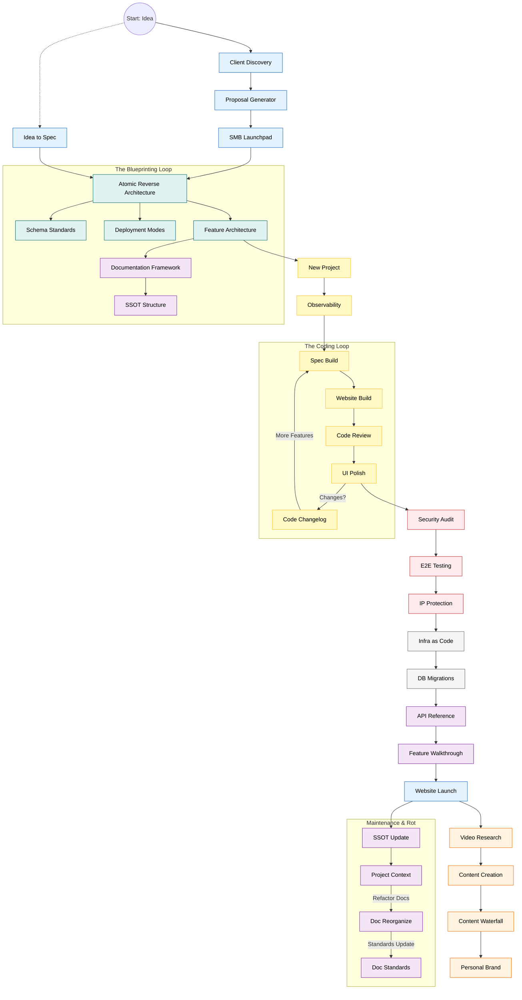

# 🧠 Skills Guide: The Complete Arsenal

This is the **Master Map** of every single skill in the framework, ordered by when you use them in the project lifecycle.

## ♾️ The Master Lifecycle Flow

Every skill has a home in the timeline.

---

## 📂 The Numbered Skills Lifecycle

### Phase 0: Context (Setup)

*Foundations before starting.*

- **[New Project](./0-context/new_project/SKILL.md)**: Initializing the repo.
- **[Project Context](./0-context/project_context/SKILL.md)**: The living heartbeat of the project.
- **[Documentation Framework](./0-context/documentation_framework/SKILL.md)**: Setting up the `.agent/docs` folder.
- **[SSOT Structure](./0-context/ssot_structure/SKILL.md)**: Defining the Single Source of Truth architecture.
- **[Codebase Navigation](./0-context/codebase_navigation/SKILL.md)**: First 30 minutes in a new codebase.

### Phase 1: Brainstorm (Requirements)

*From idea to spec.*

- **[Client Discovery](./1-brainstorm/client_discovery/SKILL.md)**: Extract requirements from stakeholders.
- **[Idea to Spec](./1-brainstorm/idea_to_spec/SKILL.md)**: Brain dump → structured spec → multi-AI review (all-in-one).
- **[Proposal Generator](./1-brainstorm/proposal_generator/SKILL.md)**: Create the Statement of Work (SOW).
- **[SMB Launchpad](./1-brainstorm/smb_launchpad/SKILL.md)**: Strategy for small business clients.

### Phase 2: Design (Architecture)

*Designing the blueprint.*

- **[Atomic Reverse Architecture](./2-design/atomic_reverse_architecture/SKILL.md)**: Core system decomposition.
- **[Feature Architecture](./2-design/feature_architecture/SKILL.md)**: Detailed design of sub-systems.
- **[Deployment Modes](./2-design/deployment_modes/SKILL.md)**: Choosing the infra stack (Vercel/AWS).
- **[Schema Standards](./2-design/schema_standards/SKILL.md)**: Designing the database.

### Phase 3: Build (Construction)

*Writing the code.*

- **[Spec Build](./3-build/spec_build/SKILL.md)**: The main loop: Plan -> Code -> Verify.
- **[Bug Troubleshoot](./3-build/bug_troubleshoot/SKILL.md)**: Structured process for fixing bugs.
- **[Website Build](./3-build/website_build/SKILL.md)**: Specialized skill for web app scaffolding.
- **[Observability](./3-build/observability/SKILL.md)**: Logs, Metrics, and Tracing setup.
- **[Code Review](./3-build/code_review/SKILL.md)**: Quality assurance on code.
- **[Code Review Response](./3-build/code_review_response/SKILL.md)**: Responding to PR feedback professionally.
- **[UI Polish](./3-build/ui_polish/SKILL.md)**: Aesthetic refinement.
- **[Code Changelog](./3-build/code_changelog/SKILL.md)**: Tracking what changed in this session.
- **[Git Workflow](./3-build/git_workflow/SKILL.md)**: Branch strategy, commits, PRs, conflict resolution.
- **[API Design](./3-build/api_design/SKILL.md)**: RESTful API design, pagination, error responses.
- **[Error Handling](./3-build/error_handling/SKILL.md)**: Exception filters, structured errors, frontend patterns.
- **[Auth Implementation](./3-build/auth_implementation/SKILL.md)**: JWT, RBAC, OAuth, MFA implementation.
- **[Docker Development](./3-build/docker_development/SKILL.md)**: Dockerfiles, docker-compose, dev containers.
- **[Environment Setup](./3-build/environment_setup/SKILL.md)**: Tooling, linting, editor config, first-day checklist.
- **[Refactoring](./3-build/refactoring/SKILL.md)**: Code smells, extract patterns, safe refactoring.
- **[Database Optimization](./3-build/database_optimization/SKILL.md)**: Indexes, EXPLAIN, N+1, connection pooling.

### Phase 4: Secure (Verification)

*Locking it down.*

- **[Security Audit](./4-secure/security_audit/SKILL.md)**: Vulnerability scanning.
- **[End-to-End Testing](./4-secure/e2e_testing/SKILL.md)**: Critical path browser automation.
- **[IP Protection](./4-secure/ip_protection/SKILL.md)**: Licensing and copyright headers.

### Phase 5: Ship (Delivery)

*Shipping it.*

- **[Infrastructure as Code](./5-ship/infrastructure_as_code/SKILL.md)**: Reproducible deployment scripts (Terraform/Docker).
- **[Database Migrations](./5-ship/db_migrations/SKILL.md)**: Managing safe schema updates.
- **[Website Launch](./5-ship/website_launch/SKILL.md)**: Go-Live checklist.

### Phase 6: Handoff (Final Docs)

*Passing the torch.*

- **[API Reference](./6-handoff/api_reference/SKILL.md)**: Swagger/OpenAPI documentation.
- **[Feature Walkthrough](./6-handoff/feature_walkthrough/SKILL.md)**: Recording the "Proof of Work".
- **[Doc Reorganize](./6-handoff/doc_reorganize/SKILL.md)**: Cleaning up "Documentation Debt".

### Phase 7: Maintenance (Sustainment)

*Keeping it alive.*

- **[SSOT Update](./7-maintenance/ssot_update/SKILL.md)**: **CRITICAL**. Syncing code changes back to docs.
- **[Documentation Standards](./7-maintenance/documentation_standards/SKILL.md)**: Enforcing style across docs.
- **[SOP Standards](./7-maintenance/sop_standards/SKILL.md)**: Updating Standard Operating Procedures.
- **[WI Standards](./7-maintenance/wi_standards/SKILL.md)**: Updating Work Instructions.

### Toolkit (Growth & Extras)

*Tools for growth.*

- **[Video Research](./toolkit/video_research/SKILL.md)**: Finding viral topics.
- **[Content Creation](./toolkit/content_creation/SKILL.md)**: Scripting and filming.
- **[Content Waterfall](./toolkit/content_waterfall/SKILL.md)**: Repurposing content.
- **[Personal Brand](./toolkit/personal_brand/SKILL.md)**: Long-term authority building.
