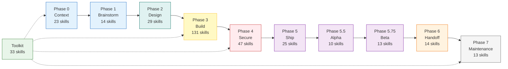
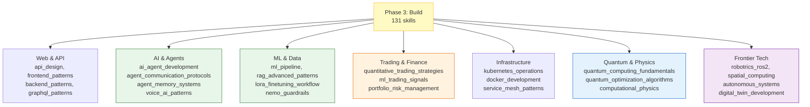

# Skills Guide

**352 skills** across 11 phases covering the complete software development lifecycle plus cross-cutting domains.

## Lifecycle Flow



## Phase 3 — Build Domain Coverage

The Build phase covers 131 skills across these domains:



## Quick Navigation

| Phase | Count | Focus | Start Here |
|-------|-------|-------|------------|
| [0-context](./0-context/) | 23 | Project understanding | `new_project`, `codebase_navigation` |
| [1-brainstorm](./1-brainstorm/) | 14 | Ideas to specs | `idea_to_spec`, `prd_generator` |
| [2-design](./2-design/) | 29 | Architecture | `atomic_reverse_architecture`, `feature_architecture` |
| [3-build](./3-build/) | 131 | Implementation | `spec_build`, `ai_agent_development`, `api_design` |
| [4-secure](./4-secure/) | 47 | Testing + security | `security_audit`, `tdd_workflow`, `ai_red_teaming` |
| [5-ship](./5-ship/) | 25 | Deployment | `ci_cd_pipeline`, `deployment_patterns`, `nvidia_nim_deployment` |
| [5.5-alpha](./5.5-alpha/) | 10 | Early ops | `error_tracking`, `health_checks` |
| [5.75-beta](./5.75-beta/) | 13 | User feedback | `product_analytics`, `feedback_system` |
| [6-handoff](./6-handoff/) | 14 | Documentation | `api_reference`, `feature_walkthrough` |
| [7-maintenance](./7-maintenance/) | 13 | Sustainability | `incident_response_operations`, `slo_sla_management` |
| [toolkit](./toolkit/) | 33 | Cross-cutting | `age` (ATOM v3), `openclaw_platform_patterns` |

## Skill File Format

Every skill lives at `.agent/skills/{phase}/{skill_name}/SKILL.md` and contains:

```
---
name: "Skill Name"
description: "What it does"
triggers:
  - "/trigger-command"
---

# Skill Name

## WHEN TO USE
## PROCESS
## CHECKLIST
## Related Skills
```

For the complete 352-skill index, see [skills-index.md](../skills-index.md) or [CLAUDE.md](../../CLAUDE.md).
