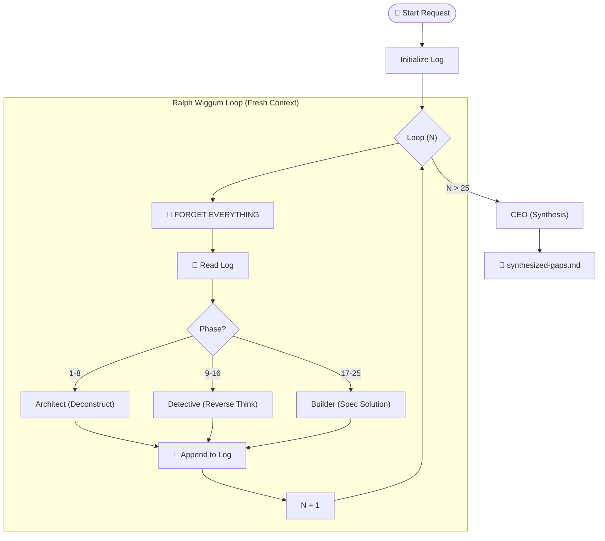

# Adversarial Gap Engine (AGE)

> "I'm a unit tester!" - Ralph Wiggum

## 🧠 The Philosophy (Ralph Wiggum Loops)

The **Adversarial Gap Engine** is not a single smart agent. It is a **process** of 25 independent, isolated iterations (loops).

**The Golden Rule**: *Every loop starts with 0 context.*
Like Ralph Wiggum, the AI forgets everything that happened 5 minutes ago. It only knows what is written in the gap log.

## 🔄 The 25-Loop Protocol

Run this loop 25 times. For each iteration `N` (1 to 25):

### Step 1: 🧠 RESET CONTEXT

* **Action**: Completely clear the chat history. Forget all previous instructions.
* **Input**: Read `memory/gaps.log` (The only persistent memory).

### Step 2: 🎭 DETERMINE ROLE

Based on the Loop Number `N`:

* **Loops 1-8 (The Architect)**: Deconstruct the Topic.
  * *Goal*: Identify atomic "First Principles".
* **Loops 9-16 (The Detective)**: Find the invisible gaps.
  * *Goal*: Use **Reverse Thinking (RT-ICA)**. If the system works, what *must* have happened before?
* **Loops 17-25 (The Builder)**: Define the solution.
  * *Goal*: Generate the specific Agent/Workflow spec to fix the gap.

### Step 3: 📝 EXECUTE & LOG

* Run the selected Agent Persona.
* **Output**: Append the finding to `memory/gaps.log`.
* *Format*: `[Loop N] [Role] -> {Finding}`

---

## 🏁 The CEO Synthesis (Loop 26)

Once 25 loops are complete:

1. **Deduplicate** inputs.
2. **Prioritize** by Risk.
3. **Group** into logical "Teams".
4. **Output**: Write `synthesized-gaps.md`.

## 📊 Logic Visualization



## Usage with Claude Code Agent Teams

This skill maps perfectly to **Claude Code Agent Teams**:

```
Create an agent team with 4 teammates for an AGE analysis:
- 1 Architect teammate: deconstruct the problem into first principles
- 1 Detective teammate: use reverse thinking to find hidden gaps  
- 1 Builder teammate: spec solutions for each gap found
- 1 CEO teammate: synthesize all findings into a prioritized report
```
