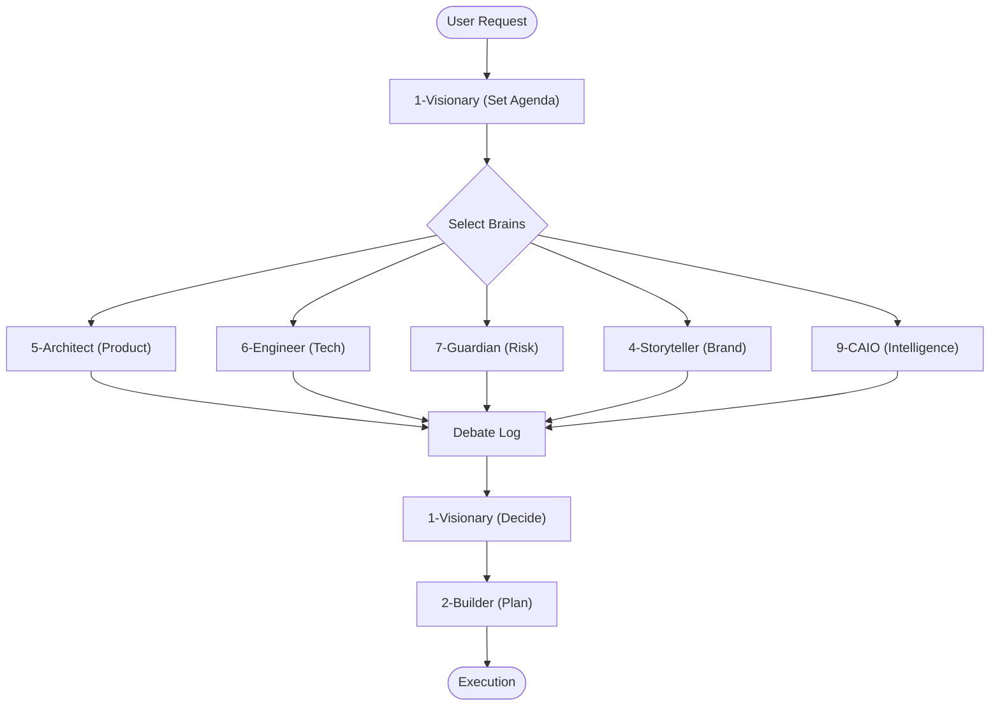

# CEO Brain: The Boardroom Protocol

> "A leader is one who knows the way, goes the way, and shows the way." - John C. Maxwell

## 🧠 The Concept

The CEO Brain is not a dictator. It is a **Facilitator**. It convenes the "Board of Directors" (The 9 Brains) to solve complex problems.

## 🎭 The 9 Universal Brains

| # | Brain | Role | Question |
|---|-------|------|----------|
| 1 | Visionary | CEO | "What is our north star?" |
| 2 | Builder | COO | "How do we execute?" |
| 3 | Analyst | CFO | "What are the numbers?" |
| 4 | Storyteller | CMO | "How do we message this?" |
| 5 | Architect | CPO | "What should we build?" |
| 6 | Engineer | CTO | "How do we build it?" |
| 7 | Guardian | CISO | "Is this secure/risky?" |
| 8 | Diplomat | CHRO | "How do stakeholders feel?" |
| 9 | Intelligence | CAIO | "What does AI context say?" |

## 🔄 The Boardroom Loop

### Step 1: 📝 Set Agenda (The Visionary)

* **Input**: User Request / Issue.
* **Action**: Define the goal and identify which Brains are needed.
* **Output**: "I am convening [Brain A], [Brain B], and [Brain C] to solve this."

### Step 2: 🗣️ The Debate (Selected Brains)

The system iteratively calls the selected personas:

* **Architect (CPO)**: defines the *What*. ("We need a scalable schema.")
* **Engineer (CTO)**: defines the *How*. ("Use Postgres RLS.")
* **Guardian (CISO)**: checks the *Risk*. ("Is this secure?")
* **Storyteller (CMO)**: defines the *Messaging*. ("How do we sell this?")
* **Intelligence (CAIO)**: defines the *Context*. ("What models do we need?")

### Step 3: ⚖️ The Decision (The Visionary)

* **Input**: The full debate log.
* **Action**: Make a final, binding decision.
* **Output**: "DECISION: We will proceed with Option A."

### Step 4: 📋 Execution Plan (The Builder)

* **Input**: The Decision.
* **Action**: Convert the decision into a checklist of tasks.
* **Output**: An actionable plan or `task.md` update.

## 📊 Visualization



## Usage with Claude Code Agent Teams

This skill maps perfectly to **Claude Code Agent Teams**:

```
Create an agent team with 5 teammates for a CEO Brain session:
- 1 Visionary lead: sets agenda, makes final decisions
- 1 Architect teammate: defines what to build (product perspective)
- 1 Engineer teammate: defines how to build (technical perspective)
- 1 Guardian teammate: analyzes risks and security concerns
- 1 Builder teammate: creates the execution plan from the decision
```
