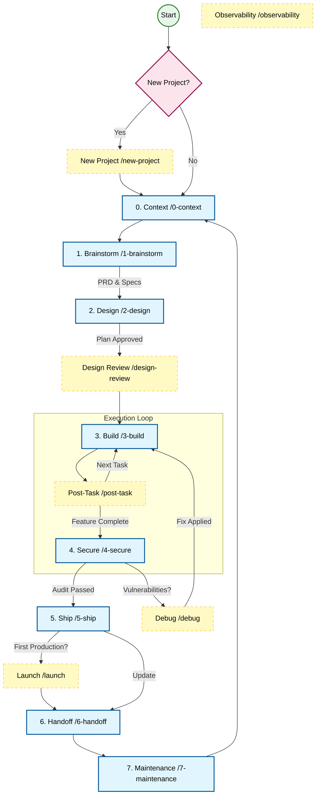

# AI Development Workflows

riftkit is designed to guide you through the entire software development lifecycle, from raw idea to client handoff. It consists of a **Golden Path** (Core Lifecycle) and a **Toolkit** (Specialized Workflows).

## 📊 Workflow Ecosystem

## 🌟 The Golden Path (Core Lifecycle)

These numbered workflows represent the standard sequence of a project.

### [0-context.md](./0-context.md) (Context Management)

**Slash Command:** `/0-context` or `/handoff`
**Purpose:** The entry and exit point for every session. Use this to Resume work with full context or Handoff work to another agent/session.

### [1-brainstorm.md](./1-brainstorm.md) (Requirements Engineering)

**Slash Command:** `/1-brainstorm` or `/idea-to-spec`
**Purpose:** The creative entry point. Turn raw ideas into structured PRDs, SOPs, and Implementation Plans. "Raw ideas go in, structured docs come out."

### [2-design.md](./2-design.md) (Architecture & Planning)

**Slash Command:** `/2-design` or `/plan`
**Purpose:** Deep planning using First Principles Decomposition (Atomic Reverse Architecture). Breaks visions into atomic, implementable units and verifying technical feasibility.

### [3-build.md](./3-build.md) (Execution)

**Slash Command:** `/3-build` or `/build`
**Purpose:** The coding phase. Implements the plan with strict TDD (Test Driven Development) and entropy checks to ensure high-quality code.
**Agents:** `planner`, `tdd-guide`, `build-error-resolver`, `code-reviewer`, `refactor-cleaner`, `database-reviewer`, `go-reviewer`, `go-build-resolver`, `python-reviewer`
**Commands:** `/plan`, `/tdd`, `/build-fix`, `/code-review`, `/refactor-clean`, `/go-build`, `/go-review`, `/python-review`, `/verify`, `/multi-backend`, `/multi-frontend`

### [4-secure.md](./4-secure.md) (Security & Quality)

**Slash Command:** `/4-secure` or `/audit`
**Purpose:** Comprehensive security and quality audit. Checks OWASP Top 10, dependencies, and code quality before shipping.
**Agents:** `security-reviewer`, `code-reviewer`, `e2e-runner`, `tdd-guide`
**Commands:** `/code-review`, `/e2e`, `/tdd`, `/verify`, `/test-coverage`

### [5-ship.md](./5-ship.md) (Deployment Prep)

**Slash Command:** `/5-ship` or `/ship`
**Purpose:** Prepares the codebase for production. Includes containerization (Docker), build verification, and final pre-flight checks.

### [6-handoff.md](./6-handoff.md) (Client Exit Strategy)

**Slash Command:** `/6-handoff` or `/client_handoff`
**Purpose:** The "Exit Package" for handing over a completed project to a client. Ensures you are safely removed from the critical path and the client is set up for success.
**Agents:** `doc-updater`
**Commands:** `/update-docs`, `/update-codemaps`

### [7-maintenance.md](./7-maintenance.md) (Sustainment)

**Purpose:** A systematic approach to bug fixing, updates, and technical debt repayment after the project is live.

---

## 🧰 The Toolkit (Specialized Workflows)

These workflows are used on-demand for specific tasks.

### [new-project.md](./toolkit/new-project.md)

**Slash Command:** `/new-project`
**Purpose:** Sets up a brand new project from scratch with the correct folder structure (`.agent/`) and documentation templates.

### [post-task.md](./toolkit/post-task.md)

**Slash Command:** `/post-task`
**Purpose:** **MANDATORY** checklist to run after *every* task. Ensures documentation (SSoT, Walkthroughs, Context) is kept in sync with code.

### [debug.md](./toolkit/debug.md)

**Slash Command:** `/debug`
**Purpose:** A structured troubleshooting process to identify root causes and fix bugs systematically.

### [launch.md](./toolkit/launch.md)

**Slash Command:** `/launch`
**Purpose:** The Go-Live checklist. Covers DNS, SSL, SEO, Analytics, and Legal requirements for launching a website.

### [design-review.md](./toolkit/design-review.md)

**Slash Command:** `/design-review`
**Purpose:** Review UI/UX designs and integrate with tools like Google Stitch or Figma before implementation.

### [observability.md](./toolkit/observability.md)

**Slash Command:** `/observability`
**Purpose:** Design monitoring, logging, and tracing strategy. Defines the "Golden Signals" and alerting rules.

### [content_production.md](./toolkit/content_production.md)

**Purpose:** A waterfall workflow for high-volume content creation (Video -> Shorts -> Text).

---

## 🚀 Getting Started

1. **New Project?** Start with `/new-project`.
2. **Existing Project?** Start with `/0-context` (Resume).
3. **Have an Idea?** Run `/1-brainstorm`.

---

---

## 🤖 Agents & Commands

The framework includes **19 specialized agents** and **44 slash commands** that integrate with these workflows. Agents automate specific tasks (code review, testing, security analysis) while commands provide the interface to invoke them.

- **Agents**: See [../agents/README.md](../agents/README.md)
- **Commands**: See [../commands/README.md](../commands/README.md)
- **Rules**: See [../rules/README.md](../rules/README.md) — coding guidelines agents follow
- **Hooks**: See [../hooks/README.md](../hooks/README.md) — event-driven automations

---

*riftkit — 339 Skills | 19 Agents | 44 Commands | 45 Rules | 25 Workflows | 64 Docs*
