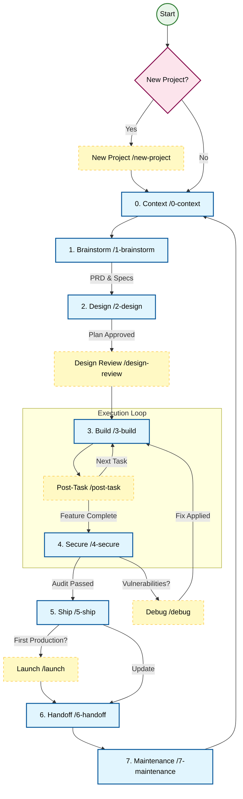

# AI Development Workflow Ecosystem

```mermaid
graph TD
    %% --- Styles ---
    classDef core fill:#e1f5fe,stroke:#01579b,stroke-width:2px,color:#000;
    classDef tool fill:#fff9c4,stroke:#fbc02d,stroke-width:1px,stroke-dasharray: 5 5,color:#000;
    classDef decision fill:#fce4ec,stroke:#880e4f,stroke-width:2px,shape:diamond,color:#000;
    classDef start fill:#e8f5e9,stroke:#2e7d32,stroke-width:2px,shape:circle,color:#000;

    %% --- Nodes ---
    Start((Start)):::start
    DecisionNew{"New Project?"}:::decision
    
    %% Core Workflows (The Golden Path)
    Context["0. Context /0-context"]:::core
    Brainstorm["1. Brainstorm /1-brainstorm"]:::core
    Design["2. Design /2-design"]:::core
    Build["3. Build /3-build"]:::core
    Secure["4. Secure /4-secure"]:::core
    Ship["5. Ship /5-ship"]:::core
    Handoff["6. Handoff /6-handoff"]:::core
    Maint["7. Maintenance /7-maintenance"]:::core

    %% Toolkit Workflows
    ToolNew["New Project /new-project"]:::tool
    ToolDesignRev["Design Review /design-review"]:::tool
    ToolPost["Post-Task /post-task"]:::tool
    ToolDebug["Debug /debug"]:::tool
    ToolLaunch["Launch /launch"]:::tool

    %% --- Connections ---
    
    %% Entry
    Start --> DecisionNew
    DecisionNew -- Yes --> ToolNew
    ToolNew --> Context
    DecisionNew -- No --> Context
    
    %% Phase 1: Planning
    Context --> Brainstorm
    Brainstorm -- "PRD & Specs" --> Design
    
    %% Phase 2: Execution
    Design -- "Plan Approved" --> ToolDesignRev
    ToolDesignRev --> Build
    
    subgraph "Execution Loop"
        Build --> ToolPost
        ToolPost -- "Next Task" --> Build
        ToolPost -- "Feature Complete" --> Secure
    end
    
    %% Phase 3: Verification
    Secure -- "Vulnerabilities?" --> ToolDebug
    ToolDebug -- "Fix Applied" --> Build
    
    %% Phase 4: Delivery
    Secure -- "Audit Passed" --> Ship
    Ship -- "First Production?" --> ToolLaunch
    ToolLaunch --> Handoff
    Ship -- "Update" --> Handoff
    
    %% Phase 5: Exit & Sustain
    Handoff --> Maint
    Maint --> Context

    %% Notes
```
