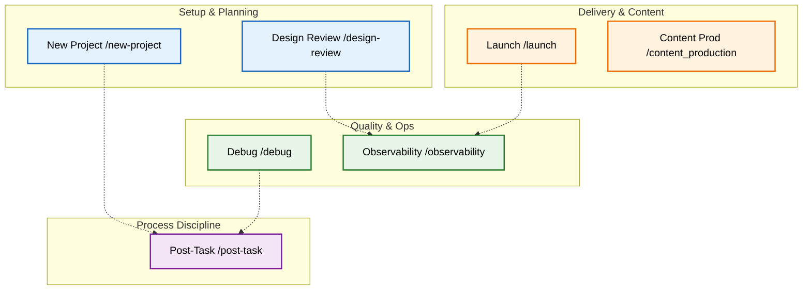

# 🧰 The Toolkit

The **Toolkit** contains specialized, on-demand workflows that support the Core Golden Path. Unlike the sequential core workflows (0-7), these tools can be pulled off the shelf whenever needed.

## 🗺️ Toolkit Ecosystem

---

## 🛠️ Tool Index

### 🔹 Setup & Planning

| Workflow | Command | Purpose |
| :--- | :--- | :--- |
| **[New Project](./new-project.md)** | `/new-project` | Initialize a new repository with the correct `.agent` structure. |
| **[Design Review](./design-review.md)** | `/design-review` | Validate UI/UX designs against requirements before coding. |

### 🔹 Quality & Operations

| Workflow | Command | Purpose |
| :--- | :--- | :--- |
| **[Debug](./debug.md)** | `/debug` | Systematic troubleshooting: Reproduce -> Diagnose -> Fix -> Verify. |
| **[Observability](./observability.md)** | `/observability` | Design metrics, logging, and alerting strategies (The "Golden Signals"). |

### 🔹 Process Discipline

| Workflow | Command | Purpose |
| :--- | :--- | :--- |
| **[Post-Task](./post-task.md)** | `/post-task` | **MANDATORY**. Run this after *every* task to sync documentation and context. |

### 🔹 Delivery & Content

| Workflow | Command | Purpose |
| :--- | :--- | :--- |
| **[Launch](./launch.md)** | `/launch` | The Go-Live checklist (DNS, SEO, Legal, Analytics). |
| **[Content Production](./content_production.md)** | N/A | Waterfall process for high-volume content creation (Video -> Shorts -> Blog). |
