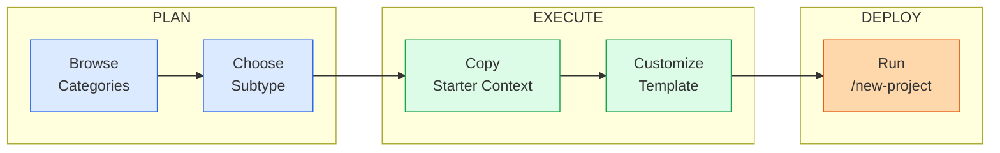

# Blueprint Library Guide

> **339 Skills | 19 Agents | 44 Commands | 44 Rules | 64 Docs | 25 Workflows**

Every project type has different needs. A trading bot demands financial compliance from day one; a mobile game cares deeply about frame rates and store submission but will never think about GDPR cookie banners. Blueprints give you a head start by encoding those domain differences into ready-made starter templates so your AI assistant understands the terrain before writing a single line of code.

A blueprint provides three things. First, a pre-filled context template that seeds `.agent/docs/0-context/` with the right questions for your domain. Second, a set of domain-specific checklists that surface concerns you would otherwise discover too late -- gas optimization for smart contracts, latency budgets for trading systems, platform certification for console games. Third, a recommended tech stack that reflects current best practices rather than whatever the AI last saw in its training data.

The full lifecycle that governs all projects is documented in [MASTER-LIFECYCLE.md](MASTER-LIFECYCLE.md). Blueprints do not replace that lifecycle; they adjust its emphasis. If you are joining an existing project rather than starting fresh, see [EXISTING_PROJECT_GUIDE.md](EXISTING_PROJECT_GUIDE.md) for the inherit/adopt workflow instead.

---

## How to Use Blueprints

Blueprints live in `.agent/blueprints/` and are organized by category. The recommended flow is straightforward: browse the nine categories below, choose the subtype that matches your project, copy its starter context into your project's `.agent/docs/0-context/` folder, then customize the template with your specific details.

The `/new-project` command handles most of this automatically. When you run it, the `new_project` skill walks you through blueprint selection as its very first step. It reads the category list, asks you to pick a subtype, and copies the corresponding starter template into your project structure. From there, you fill in the blanks -- project name, tech stack preferences, core features, deployment target -- and the framework has enough context to guide every subsequent phase.

If no blueprint matches your project exactly, pick the closest one and edit it. A Figma plugin shares more DNA with a Chrome extension than with a full-stack SaaS app, so starting from `08-plugins-and-extensions` and trimming what you do not need will always be faster than starting from scratch. You can also combine elements: a DeFi dashboard might pull its financial compliance checklist from `03-trading-and-finance` while using the frontend patterns from `01-web-and-apps`.

Every blueprint assumes you will follow the standard lifecycle phases (Context through Maintenance). The difference is which phases get heavy investment and which ones you can treat as lightweight pass-throughs. The category sections below call out those differences explicitly.

---

## Blueprint Categories

---

### 01 -- Web and Apps

Web applications and their cousins -- command-line tools, desktop apps, browser extensions, and mobile apps -- represent the broadest category in the library. These projects share a common lifecycle backbone (authentication, data persistence, deployment, monitoring) but diverge sharply in their delivery mechanisms and platform constraints.

The following subtypes cover the full range of projects where a user interacts with software through a screen, a terminal, or a browser. All lifecycle skills apply here, with `desktop_publishing` added for projects that ship installable binaries.

| Subtype | Description | Key Skills | Lifecycle Adjustments |
|---------|-------------|------------|----------------------|
| `full-stack-app` | SaaS platforms, multi-tenant apps, internal tools with both frontend and backend | All lifecycle skills | Full lifecycle -- no phases skipped |
| `chrome-extensions` | Browser extensions for Chrome and Chromium-based browsers | `extension_development` | Lighter on Alpha/Beta ops; heavier on store submission and review policies |
| `cli-tools` | Command-line utilities and developer tools | All lifecycle skills | Skip UI polish; invest in argument parsing, help text, and shell compatibility |
| `desktop-apps` | Electron, Tauri, or native desktop applications | `desktop_publishing` | Add auto-update, code signing, and platform-specific packaging |
| `e-commerce` | Online stores with product catalogs, carts, and checkout | All lifecycle skills | Heavy on legal compliance, payment security, and performance testing |
| `marketing-sites` | Landing pages, corporate sites, and campaign pages | `website_build`, `website_launch` | Skip Alpha/Beta ops entirely; focus on SEO, Core Web Vitals, and launch |
| `mobile-apps` | React Native, Flutter, or native iOS/Android apps | All lifecycle skills | Add app store submission, push notifications, and offline-first patterns |
| `static-websites` | Documentation sites, blogs, and JAMstack projects | `website_build`, `website_launch` | Lightest lifecycle -- skip Build backend, Alpha/Beta, most of Secure |
| `wordpress-themes` | Custom WordPress themes and child themes | `website_build` | Add theme review standards, PHP security patterns, and WP-CLI workflows |

If you are building a full-stack SaaS product, lean into every lifecycle phase without exception. For a marketing site or static blog, you can safely skip Phases 5.5 and 5.75 (Alpha and Beta Ops) and keep Phase 4 (Secure) focused on accessibility and performance rather than penetration testing.

---

### 02 -- Games

Game development follows a fundamentally different rhythm than web development. The build phase is longer and more iterative, testing is dominated by playtesting rather than unit tests, and "shipping" means passing platform certification rather than deploying a Docker container. These blueprints bring game-specific concerns into the lifecycle without losing the structure that keeps projects on track.

| Subtype | Description | Key Skills | Lifecycle Adjustments |
|---------|-------------|------------|----------------------|
| `console-games` | PlayStation, Xbox, and Nintendo Switch titles | `game_development`, `game_publishing` | Add platform certification, TRC/XR compliance, age rating submission |
| `mobile-games` | iOS and Android games with touch controls | `game_development`, `game_publishing` | Add store optimization, IAP compliance, ad SDK integration |
| `steam-pc-games` | PC games distributed through Steam or Epic | `game_development`, `game_publishing` | Add Steamworks integration, achievement systems, workshop support |
| `web-games` | Browser-based games using WebGL, Canvas, or HTML5 | `game_development`, `multiplayer_systems` | Lighter deployment; focus on load time, WebSocket infrastructure |

If you are building a multiplayer game of any kind, the `multiplayer_systems` skill becomes critical during the Design phase. Netcode architecture, state synchronization, and matchmaking are decisions that cannot be deferred to Build without causing painful rework.

---

### 03 -- Trading and Finance

Financial software carries regulatory weight that most other categories never encounter. A bug in a trading algorithm is not just a bad user experience -- it is real money lost in real time. These blueprints front-load compliance and testing concerns so that risk management is baked into the architecture rather than bolted on after the first margin call.

| Subtype | Description | Key Skills | Lifecycle Adjustments |
|---------|-------------|------------|----------------------|
| `defi-protocols` | Decentralized finance protocols (lending, DEX, yield) | `trading_systems`, `financial_compliance`, `smart_contract_dev` | Combine with Web3 security; add formal verification and audit phases |
| `mt4-mt5-expert-advisors` | MetaTrader expert advisors and indicators in MQL4/MQL5 | `trading_systems`, `financial_compliance` | Platform-specific build; skip web deployment; add backtesting rigor |
| `quantitative-research` | Statistical models, alpha research, and factor analysis | `trading_systems` | Heavy on Design (model validation); lighter on Ship (internal tooling) |
| `trading-algorithms` | Automated execution strategies across asset classes | `trading_systems`, `financial_compliance` | Add latency profiling, order management, and kill-switch architecture |
| `trading-bots` | Fully automated trading systems with exchange connectivity | `trading_systems`, `financial_compliance` | Full lifecycle with emphasis on monitoring, circuit breakers, and disaster recovery |
| `tradingview-indicators` | Pine Script indicators and strategies for TradingView | `trading_systems` | Lightest in this category; skip most ops phases; focus on calculation accuracy |

If you are building a trading bot, lean heavily on `trading_systems` and `financial_compliance` from Phase 2 onward. Design your circuit breakers and position limits before you write a single order placement function. The disaster recovery runbook is not optional here -- it is the difference between a bad day and a catastrophic one.

---

### 04 -- Web3 and Blockchain

Blockchain projects introduce a constraint that web developers rarely face: immutability. Once a smart contract is deployed, you cannot hotfix it. This reality inverts the normal lifecycle emphasis -- testing and security consume far more time than deployment, and the Design phase must account for upgrade patterns (proxies, diamonds) that would be unnecessary in traditional software.

| Subtype | Description | Key Skills | Lifecycle Adjustments |
|---------|-------------|------------|----------------------|
| `blockchain-explorer` | Block and transaction explorers with indexing pipelines | `dapp_development` | Heavy on data pipeline; add indexer architecture and RPC management |
| `custom-crypto-token` | ERC-20, ERC-721, or custom token implementations | `smart_contract_dev`, `web3_security` | Short lifecycle; heavy on Secure (audit) and Ship (mainnet deployment) |
| `dao` | Decentralized autonomous organizations with governance | `smart_contract_dev`, `dapp_development`, `web3_security` | Add governance modeling, voting mechanisms, and treasury management |
| `dapp` | Decentralized applications with wallet connectivity | `dapp_development`, `web3_security` | Full lifecycle plus wallet integration, chain switching, and gas optimization |
| `defi-protocol` | Lending, borrowing, AMM, and yield protocols | `smart_contract_dev`, `web3_security`, `trading_systems` | Heaviest in this category; formal verification mandatory; add economic modeling |
| `layer-2-solutions` | Rollups, sidechains, and scaling infrastructure | `smart_contract_dev`, `web3_security` | Deep infrastructure focus; add bridge security, sequencer design, and fraud proofs |
| `nft-collection` | Generative art collections with metadata and minting | `smart_contract_dev`, `web3_security` | Add metadata standards, reveal mechanics, and royalty enforcement |
| `nft-marketplace` | Platforms for listing, bidding, and trading NFTs | `dapp_development`, `smart_contract_dev`, `web3_security` | Combine marketplace UX with escrow contract security |
| `smart-contract-auditing` | Tooling and workflows for auditing third-party contracts | `web3_security`, `smart_contract_dev` | Inverted lifecycle -- the "Build" phase produces audit reports, not deployable code |
| `wallet` | Cryptocurrency wallets (browser extension, mobile, hardware) | `dapp_development`, `web3_security` | Extreme security focus; add key management, transaction signing, and backup/recovery |

For any project touching user funds, the `web3_security` skill is non-negotiable. Schedule at least one external audit before mainnet deployment, and use the `smart_contract_dev` skill's testing patterns (fuzzing, invariant testing, formal verification) throughout the Build phase rather than saving them for Secure.

---

### 05 -- AI and ML

AI projects blur the line between software engineering and research. The "Build" phase often looks more like experimentation -- training runs, hyperparameter sweeps, evaluation benchmarks -- and "Deployment" means serving a model behind an inference API rather than shipping a traditional web app. These blueprints structure the experimentation without killing the exploratory nature that makes AI work productive.

| Subtype | Description | Key Skills | Lifecycle Adjustments |
|---------|-------------|------------|----------------------|
| `ai-agent-chatbot` | Conversational agents, customer support bots, copilots | `prompt_engineering`, `ml_pipeline` | Add conversation design, guardrails, and evaluation harnesses |
| `computer-vision` | Image classification, object detection, segmentation | `ml_pipeline`, `mlops` | Heavy on data pipeline and training infrastructure; add annotation workflows |
| `data-pipeline` | ETL and feature engineering pipelines for ML | `ml_pipeline`, `mlops` | Focus on data quality, lineage tracking, and pipeline orchestration |
| `fine-tuning-pipeline` | LLM and foundation model fine-tuning workflows | `ml_pipeline`, `prompt_engineering`, `mlops` | Add dataset curation, evaluation benchmarks, and cost tracking |
| `ml-model-training` | Custom model training from scratch or transfer learning | `ml_pipeline`, `mlops` | Longest Build phase; add experiment tracking, GPU management, and checkpointing |
| `rag-application` | Retrieval-augmented generation systems | `prompt_engineering`, `ml_pipeline` | Add embedding strategy, chunk optimization, and retrieval evaluation |
| `recommendation-system` | Collaborative filtering, content-based, and hybrid recommenders | `ml_pipeline`, `mlops` | Add A/B testing infrastructure, feedback loops, and cold-start handling |
| `voice-ai` | Speech-to-text, text-to-speech, and voice agents | `ml_pipeline`, `prompt_engineering` | Add audio preprocessing, latency optimization, and streaming architecture |

If you are building a RAG application, the Design phase deserves extra attention. Your chunking strategy, embedding model choice, and retrieval pipeline architecture will determine quality more than any amount of prompt engineering during Build. Use the `prompt_engineering` skill to structure your evaluation harness early, then iterate on retrieval before tuning generation.

---

### 06 -- Hardware and IoT

Hardware projects operate under constraints that pure software never encounters: limited memory, unreliable networks, real-time deadlines, and physical safety implications. A bug in a drone's flight controller is categorically different from a bug in a web form. These blueprints bring hardware-specific rigor to the Design and Secure phases while keeping the broader lifecycle structure intact.

| Subtype | Description | Key Skills | Lifecycle Adjustments |
|---------|-------------|------------|----------------------|
| `3d-printer-firmware` | Custom firmware for FDM/SLA printers (Marlin, Klipper) | `firmware_development` | Add G-code parsing, stepper motor control, and thermal safety |
| `arduino-projects` | Microcontroller projects using Arduino IDE and libraries | `firmware_development`, `iot_platform` | Lighter lifecycle; focus on pin management, power budgets, and serial comms |
| `drone-uav` | Unmanned aerial vehicle firmware and ground stations | `firmware_development` | Safety-critical; add flight controller integration, failsafes, and regulatory compliance |
| `esp32-esp8266` | WiFi/BLE microcontroller projects | `firmware_development`, `iot_platform` | Add OTA update architecture, deep sleep optimization, and mesh networking |
| `home-automation` | Smart home systems (Home Assistant, MQTT, Zigbee) | `iot_platform` | Add protocol bridging, device pairing, and local-first architecture |
| `raspberry-pi` | Single-board computer projects and edge computing | `firmware_development`, `iot_platform` | Closer to traditional software; add SD card reliability and headless deployment |
| `robotics` | Robot control systems, ROS2 integration, kinematics | `firmware_development` | Add sensor fusion, motion planning, and real-time scheduling |
| `wearables` | Fitness trackers, smartwatches, and health monitors | `firmware_development`, `iot_platform` | Add BLE profiles, power optimization, and health data compliance (HIPAA if US) |

For any IoT project that connects to the internet, treat the `iot_platform` skill's security patterns as mandatory rather than optional. Default credentials, unencrypted firmware updates, and open MQTT brokers are the low-hanging fruit that attackers target first. Design your update mechanism before you design your features.

---

### 07 -- Automation and DevOps

Automation and DevOps projects are infrastructure that other software depends on. A broken CI/CD pipeline blocks every developer on the team; a misconfigured Terraform module can take down production. These blueprints emphasize the Secure and Ship phases because the consequences of getting infrastructure wrong cascade further than a bug in any single application.

| Subtype | Description | Key Skills | Lifecycle Adjustments |
|---------|-------------|------------|----------------------|
| `ci-cd-pipelines` | GitHub Actions, GitLab CI, Jenkins pipeline definitions | `ci_cd_pipeline` | The Build phase IS the Ship phase; focus on pipeline reliability and caching |
| `infrastructure-as-code` | Terraform, Pulumi, CloudFormation templates | `infrastructure_as_code` | Heavy on Design (module structure) and Secure (IAM, least privilege) |
| `kubernetes-configs` | Helm charts, Kustomize overlays, and operator development | `infrastructure_as_code`, `observability` | Add resource limits, network policies, and rollback strategies |
| `monitoring-dashboards` | Grafana, Datadog, and custom observability dashboards | `observability`, `dashboard_development` | Inverted lifecycle -- you are building tooling for other projects' Operate phase |
| `serverless-functions` | AWS Lambda, Cloudflare Workers, Vercel Edge Functions | `ci_cd_pipeline`, `infrastructure_as_code` | Skip traditional deployment; add cold start optimization and concurrency limits |
| `shell-scripts` | Bash/Zsh automation scripts and developer tooling | `ci_cd_pipeline` | Lightest lifecycle; focus on error handling, portability, and documentation |

If you are writing infrastructure-as-code, the `infrastructure_as_code` skill's state management patterns are essential reading before you write your first resource block. Terraform state conflicts and drift detection problems are architectural decisions, not bugs you fix later.

---

### 08 -- Plugins and Extensions

Plugins and extensions live inside someone else's platform, which means you inherit that platform's constraints, review processes, and API stability (or lack thereof). The Build phase is shaped by the host platform's SDK, and the Ship phase often involves a review queue you do not control. These blueprints encode platform-specific gotchas so you do not discover them the day before launch.

| Subtype | Description | Key Skills | Lifecycle Adjustments |
|---------|-------------|------------|----------------------|
| `chrome-extensions` | Manifest V3 browser extensions with content scripts | `extension_development` | Add Chrome Web Store review compliance, permission justification |
| `figma-plugins` | Plugins and widgets for the Figma design tool | `extension_development` | Lighter lifecycle; focus on Figma API patterns and UI constraints |
| `obs-plugins` | Plugins for OBS Studio (C/C++ or Lua) | `extension_development` | Add real-time performance constraints and OBS API lifecycle management |
| `shopify-apps` | Shopify storefront and admin apps (Polaris, App Bridge) | `extension_development` | Add Shopify app review, OAuth flow, and billing API integration |
| `slack-discord-bots` | Chatbots and integrations for Slack or Discord | `extension_development` | Add event subscription management, rate limit handling, and slash command design |
| `vs-code-extensions` | Extensions for Visual Studio Code (TypeScript) | `extension_development` | Add VS Code API activation events, webview security, and marketplace publishing |
| `vst-audio-plugins` | VST/AU audio plugins for DAWs (C++, JUCE) | `extension_development` | Add real-time audio constraints, DSP optimization, and DAW compatibility testing |
| `wordpress-plugins` | WordPress plugins distributed through wp.org or privately | `extension_development` | Add WordPress coding standards, hook architecture, and plugin review guidelines |

Platform-specific review processes are the single biggest source of launch delays for plugin projects. Read the host platform's review guidelines during the Design phase, not after you have built the entire extension. The `extension_development` skill includes a pre-submission checklist for exactly this reason.

---

### 09 -- Data and Analytics

Data projects are defined by their inputs and outputs rather than their user interfaces. The "user" is often an analyst staring at a dashboard or a downstream system consuming a data feed. These blueprints emphasize the pipeline architecture (how data flows in, gets transformed, and flows out) and the quality guarantees that make the output trustworthy.

| Subtype | Description | Key Skills | Lifecycle Adjustments |
|---------|-------------|------------|----------------------|
| `data-dashboards` | Interactive dashboards for business intelligence | `dashboard_development`, `data_warehouse` | Focus on query performance, refresh schedules, and access control |
| `database-design` | Schema design, migration strategies, and optimization | `data_warehouse` | Heavy on Design; add normalization analysis, indexing strategy, and capacity planning |
| `etl-pipelines` | Extract-transform-load pipelines for data warehouses | `etl_pipeline`, `data_warehouse` | Add idempotency, failure recovery, data quality checks, and lineage tracking |
| `reporting-systems` | Automated report generation and distribution | `dashboard_development`, `etl_pipeline` | Add scheduling, template management, and delivery channel configuration |
| `scraping-crawling` | Web scrapers, crawlers, and data collection agents | `etl_pipeline` | Add rate limiting, robots.txt compliance, proxy rotation, and legal review |

If you are building an ETL pipeline, the `etl_pipeline` skill's idempotency patterns should be your first read. A pipeline that cannot be safely re-run after a partial failure is a pipeline that will eventually corrupt your data warehouse. Design for retry-safety before you design for throughput.

---

## Which Lifecycle Phases to Focus On

The table below provides a quick reference for adjusting the standard lifecycle to each project type. "Must-Do" phases cannot be skipped without accepting meaningful risk. "Optional" phases add value but can be deferred for MVPs or time-constrained projects. "Skip" phases genuinely do not apply to the project type.

Every project begins with Phase 0 (Context) regardless of type -- that is where blueprint selection happens.

| Project Type | Must-Do Phases | Optional Phases | Skip Phases |
|-------------|---------------|-----------------|-------------|
| Full-Stack SaaS | All phases (0 through 7) | None | None |
| Marketing Site | 0, 1, 2, 3, 4 (accessibility + performance), 5, 6 | 7 (Maintenance) | 5.5 Alpha, 5.75 Beta |
| Trading Bot | 0, 1, 2, 3, 4, 5, 5.5, 7 | 5.75 Beta, 6 (Handoff) | None -- treat all as must-do if real money is involved |
| Smart Contract | 0, 2, 3, 4 (security-heavy), 5 | 1 (if spec is clear), 6, 7 | 5.5 Alpha, 5.75 Beta |
| Mobile Game | 0, 1, 2, 3, 4 (playtesting), 5 (store submission) | 5.5, 5.75, 6 | 7 (if single-release title) |
| AI/ML Pipeline | 0, 1, 2, 3 (experiment-heavy), 5 | 4, 5.5, 5.75, 6 | None skippable if serving production traffic |
| IoT Firmware | 0, 2, 3, 4 (safety-critical), 5 | 1, 5.5, 6 | 5.75 Beta |
| CLI Tool | 0, 1, 2, 3, 4 (unit tests), 5 (publishing) | 6 (docs), 7 | 5.5, 5.75 |
| Browser Extension | 0, 1, 2, 3, 4 (review compliance), 5 (store submission) | 5.5, 6, 7 | 5.75 Beta |
| ETL Pipeline | 0, 2, 3, 4 (data quality), 5, 7 | 1, 5.5, 6 | 5.75 Beta |

For more detail on what each phase contains, see the phase-by-phase breakdown in [MASTER-LIFECYCLE.md](MASTER-LIFECYCLE.md).

---

## Creating Custom Blueprints

When none of the 50+ existing subtypes fit your project, create your own. Copy the closest matching starter context from `.agent/blueprints/`, rename it to reflect your domain, and edit the three core sections: the project overview template, the domain-specific ARA checklist, and the recommended tech stack. Save your custom blueprint back into the appropriate category folder (or create a new category folder under `.agent/blueprints/` if the domain is genuinely novel) so that future projects can reuse it.

The key to a good custom blueprint is specificity. Generic checklists ("Is the code tested?") add no value over the standard lifecycle. Your blueprint should surface the questions that are unique to your domain -- the ones that a generalist AI assistant would not think to ask. A blueprint for medical device software should ask about FDA 510(k) classification. A blueprint for multiplayer game servers should ask about tick rate and state reconciliation. That domain-specific surface area is what makes blueprints worth maintaining.

---

*See also: [MASTER-LIFECYCLE.md](MASTER-LIFECYCLE.md) for the complete lifecycle reference, [CLIENT_LIFECYCLE_GUIDE.md](CLIENT_LIFECYCLE_GUIDE.md) for client project workflows, and [.agent/blueprints/README.md](.agent/blueprints/README.md) for the blueprint directory itself.*
