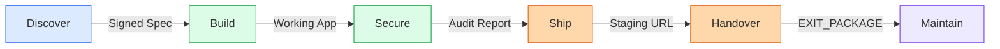

# Client Project Lifecycle Guide

> **The "Meta Workflow" for building, shipping, and handing over client projects.**

This guide is for freelancers, agencies, and consultancies. Client projects have fixed budgets,
approval gates, and handoff requirements that change how you use the framework. Where internal
projects can iterate indefinitely, client work demands a clear sequence of deliverables — each
one signed off before the next stage begins. The six stages below map every relevant command,
agent, and skill (339 Skills | 19 Agents | 44 Commands | 44 Rules | 64 Docs | 25 Workflows)
to the specific artifacts your client expects at each gate. Every stage ends with a concrete
deliverable. Miss one, and you create ambiguity about what was agreed, what was delivered, and
what happens next.

---

## When to Use This Guide

Not every project is a client project. Choosing the wrong lifecycle guide means either
over-engineering your personal work or under-delivering on a paid engagement. If you are building
for yourself or your own team with no external delivery date, follow
[MASTER-LIFECYCLE.md](MASTER-LIFECYCLE.md) instead. If you are inheriting a client's existing
codebase rather than starting fresh, begin with
[EXISTING_PROJECT_GUIDE.md](EXISTING_PROJECT_GUIDE.md) to stabilize what exists, then return here
for the delivery stages. This guide is the right choice when there is a signed contract, a delivery
date, and a person on the other side expecting a working product they can operate without you.

---

## Delivery Flow

The six stages form a linear pipeline. Each arrow represents a deliverable that must exist before the next stage begins.

---

## Stage 1: Discover

Client projects fail when requirements are assumed, not validated. The discovery stage exists to
surface every assumption, document every constraint, and produce a specification that both you and
the client can sign off on. Skip this, and you will build the wrong thing — guaranteed. A thorough
discovery phase also protects you contractually: when the client requests changes later, you can
point back to the signed spec and negotiate scope properly.

| Tool | Type | What It Does |
|------|------|-------------|
| `client_discovery` | Skill | Structured intake questionnaire capturing goals, constraints, budget, and timeline |
| `idea_to_spec` | Skill | Converts raw notes and conversations into a formal specification document |
| `proposal_generator` | Skill | Produces a client-ready proposal with scope, timeline, and pricing |
| `competitive_analysis` | Skill | Maps the competitive landscape to validate positioning and feature priorities |
| `user_research` | Skill | Synthesizes user interviews and persona data into actionable requirements |
| `/1-brainstorm` | Command | Organizes scattered ideas into structured output |
| `/plan` | Command | Invokes the planner and architect agents to produce implementation plan and architecture |
| `/2-design` | Command | Generates UI/UX design artifacts from the approved spec |
| `/design-review` | Command | Reviews mockups and outputs `ui_ux_review.md` with accessibility improvements |

**Deliverable:** Signed specification + approved UI/UX design + technical architecture document.

---

## Stage 2: Build

Building for a client means building for handoff from day one. Every architectural decision, every
naming convention, every deployment script must be understandable by someone who was not in the room
when you wrote it. Document as you go — not as an afterthought. The moment you think "I'll clean
this up later," you are creating technical debt that will surface during handover when it is most
expensive to fix.

| Tool | Type | What It Does |
|------|------|-------------|
| `spec_build` | Skill | Translates specification sections into implementation tasks |
| `code_review` | Skill | Automated code review with severity classification (CRITICAL/HIGH/MEDIUM/LOW) |
| `ui_polish` | Skill | Refines visual details, spacing, and interaction patterns |
| `observability` | Skill | Adds logging, metrics, and tracing instrumentation |
| `code_changelog` | Skill | Generates structured changelogs from git history |
| `/new-project` | Command | Scaffolds folder structure, config files, and initialized git repo |
| `/3-build` | Command | Runs the core build workflow for the current feature |
| `/tdd` | Command | Invokes the tdd-guide agent to enforce RED-GREEN-REFACTOR discipline |
| `/build-fix` | Command | Invokes the build-error-resolver agent for root cause analysis and fixes |
| `/code-review` | Command | Runs the code-reviewer agent for automated review with confidence filtering |
| `/post-task` | Command | Post-session cleanup — updates context files and usage guides |
| `/update-docs` | Command | Invokes the doc-updater agent to synchronize all documentation |
| tdd-guide | Agent | Enforces test-first workflow, prevents skipping the red phase |
| build-error-resolver | Agent | Parses build errors and applies targeted fixes with explanation |
| code-reviewer | Agent | Provides severity-classified review across the entire changeset |
| doc-updater | Agent | Keeps documentation synchronized with code changes |

Language-specific agents extend the build stage for Go (`go-reviewer`, `go-build-resolver`), Python
(`python-reviewer`), and database work (`database-reviewer` for query and schema review).

**Deliverable:** Functional, tested application with clean git history and current documentation.

---

## Stage 3: Secure

Shipping a vulnerability to a client is career-ending for a freelancer and reputation-destroying
for an agency. Security and testing are not optional — they are the bare minimum for professional
delivery. Run the full audit even if the client did not ask for it. When you hand over a security
report alongside the application, you demonstrate professionalism and protect yourself legally.

| Tool | Type | What It Does |
|------|------|-------------|
| `security_audit` | Skill | Deep vulnerability scanning across the full codebase |
| `e2e_testing` | Skill | End-to-end test generation and execution with screenshot capture |
| `unit_testing` | Skill | Unit test generation for uncovered code paths |
| `integration_testing` | Skill | Integration test generation across service boundaries |
| `accessibility_testing` | Skill | WCAG compliance checking and remediation guidance |
| `performance_testing` | Skill | Load testing, profiling, and bottleneck identification |
| `/4-secure` | Command | Runs the security-reviewer agent and produces `security_audit.md` |
| `/e2e` | Command | Invokes the e2e-runner agent with full browser-based test execution |
| `/verify` | Command | Verifies all changes are covered by tests |
| `/test-coverage` | Command | Generates a coverage report with gap analysis |
| security-reviewer | Agent | Deep security analysis with severity classification |
| e2e-runner | Agent | Executes end-to-end tests with screenshots and video artifacts |

**Deliverable:** Security audit report + test coverage report + accessibility compliance summary.

---

## Stage 4: Ship

Client deployments need rollback plans, monitoring, and ceremony. Never deploy on a Friday. Never
deploy without a rollback plan. And never hand a client a production URL without walking them
through what happens if something goes wrong. Use the alpha and beta phases to stage the rollout —
alpha deploys to a controlled environment with error tracking, beta widens the audience and adds
analytics. Only after both phases validate stability do you proceed to production.

| Tool | Type | What It Does |
|------|------|-------------|
| `ci_cd_pipeline` | Skill | Sets up continuous integration and deployment pipelines |
| `infrastructure_as_code` | Skill | Generates IaC templates for reproducible environments |
| `db_migrations` | Skill | Creates and validates database migration scripts |
| `website_launch` | Skill | Pre-launch checklist covering DNS, SSL, CDN, and cache configuration |
| `legal_compliance` | Skill | Generates privacy policy, terms of service, and GDPR compliance artifacts |
| `seed_data` | Skill | Creates production-ready seed data for initial deployment |
| `error_tracking` | Skill | Integrates error tracking (Sentry, Bugsnag) for alpha/beta phases |
| `health_checks` | Skill | Adds health check endpoints and uptime monitoring |
| `env_validation` | Skill | Validates environment variables and configuration across environments |
| `product_analytics` | Skill | Integrates analytics tracking for beta feedback |
| `feedback_system` | Skill | Sets up structured feedback collection from beta users |
| `/5-ship` | Command | Prepares release notes, version bump, and pre-flight checklist |
| `/alpha` | Command | Deploys to alpha environment with error tracking and health monitoring |
| `/beta` | Command | Widens deployment to beta audience with analytics and feedback |
| `/launch` | Command | Production deployment with DNS verification, SSL check, and smoke tests |

**Deliverable:** Production deployment + monitoring dashboard + rollback documentation.

---

## Stage 5: Handover

The EXIT_PACKAGE is the single most important deliverable in a client project. Without it, you
become the permanent bottleneck — every question, every bug, every update routes through you
forever. A proper handoff includes credentials, runbooks, training, and enough documentation for
the client or their next developer to operate independently. Invest serious time here: a two-hour
recorded training session will save you dozens of support emails.

| Tool | Type | What It Does |
|------|------|-------------|
| `feature_walkthrough` | Skill | Generates guided walkthroughs of each feature for client training |
| `api_reference` | Skill | Produces comprehensive API documentation from code annotations |
| `doc_reorganize` | Skill | Restructures documentation for the client's audience and skill level |
| `user_documentation` | Skill | Creates end-user guides with screenshots and step-by-step instructions |
| `disaster_recovery` | Skill | Documents backup procedures, recovery steps, and emergency contacts |
| `/6-handoff` | Command | Produces the EXIT_PACKAGE with credential maps, admin guides, and runbooks |
| `/update-docs` | Command | Final documentation pass to ensure everything is current |
| doc-updater | Agent | Ensures all documentation reflects the final state of the codebase |

**Deliverable:** EXIT_PACKAGE (credential maps, admin guides, runbooks, API docs, training recordings).

---

## Stage 6: Maintain

Maintenance agreements are how freelancers build recurring revenue and agencies build long-term
relationships. Even if the client does not sign a maintenance contract, leave the codebase in a
state where someone else can maintain it. Your reputation depends on what happens after you leave —
the developer who inherits your code will form an opinion about you based entirely on what they find.

| Tool | Type | What It Does |
|------|------|-------------|
| `ssot_update` | Skill | Updates the single source of truth documents after each maintenance cycle |
| `documentation_standards` | Skill | Enforces consistent documentation format across the project |
| `dependency_management` | Skill | Audits dependencies for security vulnerabilities and version drift |
| `continuous_learning` | Skill | Extracts patterns from maintenance sessions to improve future work |
| `/7-maintenance` | Command | Runs the maintenance workflow — dependency audit and upgrade plan |
| `/learn` | Command | Captures session patterns as instinct files for future reference |
| `/evolve` | Command | Applies learned patterns to improve framework behavior |

**Deliverable:** Maintenance SLA document + dependency audit schedule + configured monitoring alerts.

---

## Summary

Each stage produces a specific deliverable that gates progression to the next stage.

| Stage | Command Sequence | Key Agent | Deliverable |
|-------|-----------------|-----------|-------------|
| Discover | `/1-brainstorm` -> `/plan` -> `/2-design` -> `/design-review` | planner + architect | Signed specification |
| Build | `/new-project` -> `/3-build` -> `/tdd` -> `/code-review` -> `/post-task` | tdd-guide | Working, tested application |
| Secure | `/4-secure` -> `/e2e` -> `/verify` -> `/test-coverage` | security-reviewer | Audit + coverage reports |
| Ship | `/5-ship` -> `/alpha` -> `/beta` -> `/launch` | -- | Production URL + rollback plan |
| Handover | `/6-handoff` -> `/update-docs` | doc-updater | EXIT_PACKAGE |
| Maintain | `/7-maintenance` -> `/learn` -> `/evolve` | -- | Maintenance SLA + audit schedule |
