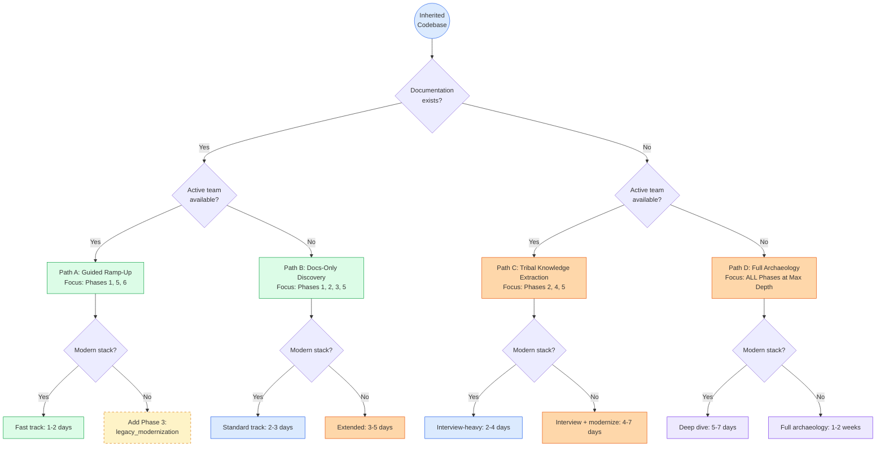
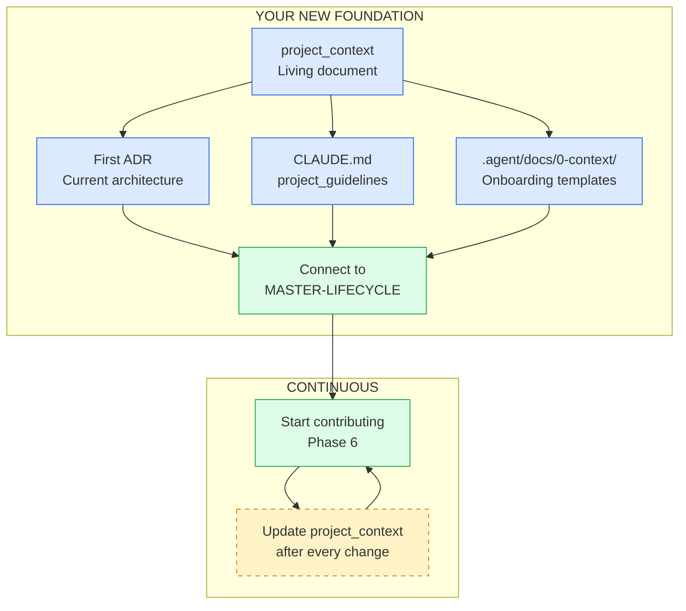
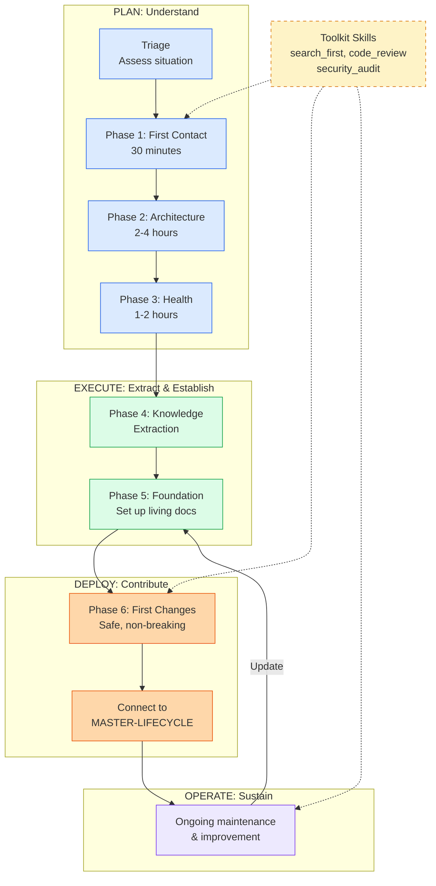

# Existing Project Onboarding Guide

## From Confused to Confident: A Structured Approach to Inheriting Code You Did Not Write

> **Part of riftkit** (`298 Skills | 19 Agents | 39 Commands | 25 Rules | 70+ Docs | 25 Workflows`)
>
> Developed through a 25-loop AGE (Adversarial Gap Engine) analysis that identified 8 critical skill gaps in the "existing project onboarding" use case.

You just got access to a codebase you have never seen before. Maybe you are a new hire onboarding to a mature product. Maybe you are a freelancer who just inherited a half-finished client project with no handoff notes. Maybe you are an architect evaluating a codebase for acquisition due diligence. Or maybe the original developer quit six months ago and the code has been sitting untouched, and now it is your problem.

The instinct in all of these situations is the same: clone the repo, open the editor, and start reading files at random. That instinct is wrong. It wastes time, it builds a fragmented mental model, and it leaves you vulnerable to the assumptions of whoever wrote the code in the first place.

This guide provides a phased, time-boxed approach that takes you from zero context to productive contributor. Each phase builds on the previous one, and each phase is tagged with a role level so you can calibrate depth to your situation. A junior developer joining an active team with good documentation can skip the architecture recovery steps entirely. An architect evaluating an acquisition with no team to interview needs every phase at maximum depth.

The framework distinguishes between two fundamentally different starting points, and the first thing you will do is figure out which one you are in.

---

## Triage: What Kind of Codebase Did You Inherit?

Every inherited codebase falls somewhere on a matrix of four variables: documentation quality, team availability, stack modernity, and system topology. The combination determines which phases of this guide deserve the most attention and which skills to lean on hardest.

Path A is the best case: someone wrote documentation, someone is around to answer questions, and the stack is not ancient. You will spend most of your time in Phase 1 (first contact) and Phase 5 (setting up your own foundation), with a quick pass through the other phases for validation. Path D is the worst case: no docs, no team, and you are staring at a mystery. That path requires every tool in the framework and should not be rushed.

Most real-world situations land on Path B or Path C. Documentation exists but is stale, or the team exists but has never written anything down. The guide is structured so that you can adjust depth per-phase based on where you land.

---

## Phase 1: First Contact (30 Minutes)

**Role level: ALL (Junior through Architect)**

The first thirty minutes set the trajectory for everything that follows. This phase is built on the `codebase_navigation` skill, which provides a 7-part structured process, but extends it with specific priorities for inherited codebases where the context window is zero.

The goal is not to understand the system. The goal is to answer five concrete questions: What does this project do? Can I run it? Can I run the tests? What is the deployment target? And how active is development?

Start with the README. If a README exists, it tells you what the original developer thought was important, which is itself a signal. If no README exists, that is also a signal -- it tells you that documentation was never a priority, and you should mentally shift toward Path C or D from the triage tree above.

Next, open the dependency manifest. In a Node project that is `package.json`. In Python it is `requirements.txt` or `pyproject.toml`. In Go it is `go.mod`. In Rust it is `Cargo.toml`. This single file tells you the framework, the major libraries, the test runner, and often the build tool. Read the scripts section if one exists -- it reveals the developer's workflow (what they ran often enough to alias).

The following table maps the first-contact artifacts to the questions they answer. Every codebase will have some subset of these, and the ones that are missing are as informative as the ones that are present.

| Artifact | What It Reveals | If Missing |
|----------|----------------|------------|
| README.md | Intent, setup instructions, architecture overview | Documentation was not prioritized; expect gaps everywhere |
| package.json / requirements.txt / go.mod | Stack, dependencies, scripts, build tools | Non-standard build system; check for Makefiles or shell scripts |
| .env.example or docker-compose.yml | External dependencies (databases, caches, APIs) | Environment setup will require archaeology |
| CI/CD config (.github/workflows, Jenkinsfile) | How it gets deployed, what tests run automatically | Deployments are manual or undocumented |
| Database schema (migrations, schema.prisma, models.py) | Data model, business domain entities | Schema lives in the ORM or is dynamically generated |
| git log --oneline -20 | Recent activity, commit style, active contributors | Repo may be archived or abandoned |

After reading these artifacts, attempt two things: run the project locally and run the test suite. If both succeed on the first try, you are in better shape than most inherited codebases. If either fails, document the failure precisely -- it is your first contribution to the project's knowledge base, and the error messages themselves are clues about missing infrastructure or configuration.

---

## Phase 2: Architecture Assessment (2-4 Hours)

**Role level: SENIOR to ARCHITECT**

Once you can describe what the project does and (ideally) run it locally, the next question is how it is structured. In a well-documented project, architecture diagrams and ADRs (Architecture Decision Records) already exist and you can validate them against the code. In an undocumented project, the architecture exists only in the code itself, and you must extract it.

This is where the `architecture_recovery` skill becomes essential. It provides a systematic process for reverse-engineering architecture from source code when no documentation exists. The skill walks through entry point discovery, dependency graph generation, service boundary identification, and cross-cutting concern mapping. The output is a set of generated diagrams and a draft ADR that captures the architecture as it actually is, not as someone once intended it to be.

```mermaid
graph LR
    subgraph "DISCOVER"
        A1["Entry Points<br/>main, routes, CLI"] --> A2["Dependency Graph<br/>imports & requires"]
        A2 --> A3["Module Boundaries<br/>packages & namespaces"]
    end

    subgraph "ANALYZE"
        A3 --> B1["Data Flow<br/>request lifecycle"]
        B1 --> B2["Cross-Cutting<br/>auth, logging, errors"]
        B2 --> B3["External Integrations<br/>APIs, databases, queues"]
    end

    subgraph "EVALUATE"
        B3 --> C1["system_design_review<br/>scalability & fault tolerance"]
        C1 --> C2["infrastructure_audit<br/>deployment topology"]
        C2 --> C3["Architecture Doc<br/>diagrams + ADR"]
    end

    style A1 fill:#dbeafe,stroke:#2563eb
    style A2 fill:#dbeafe,stroke:#2563eb
    style A3 fill:#dbeafe,stroke:#2563eb
    style B1 fill:#dcfce7,stroke:#16a34a
    style B2 fill:#dcfce7,stroke:#16a34a
    style B3 fill:#dcfce7,stroke:#16a34a
    style C1 fill:#ede9fe,stroke:#7c3aed
    style C2 fill:#ede9fe,stroke:#7c3aed
    style C3 fill:#fed7aa,stroke:#ea580c
```

The `system_design_review` skill evaluates what you find against engineering best practices. It asks the questions that matter for production systems: Where are the single points of failure? How does the system handle partial outages? Is there a caching layer, and if so, what is the invalidation strategy? Are database queries indexed appropriately, or is there a slow query hiding behind a low-traffic endpoint? What happens when the primary database goes down -- is there a replica, a failover, or just a pager alert?

The `infrastructure_audit` skill maps the deployment topology. It traces from the code outward to the infrastructure: what runs where, how services communicate, what network boundaries exist, and where data is stored at rest and in transit. In a containerized environment, this means reading Dockerfiles, compose files, Kubernetes manifests, and Terraform definitions. In a traditional deployment, it means reading deployment scripts, systemd units, and Nginx or Apache configurations.

Service boundary analysis deserves particular attention in inherited codebases. The original developer's mental model of where one service ends and another begins is often not reflected in the code. You may find a "monolith" that is actually three services sharing a database, or "microservices" that are so tightly coupled they must be deployed together. Understanding the actual boundaries, as opposed to the intended boundaries, prevents you from making changes that break implicit contracts between components.

For distributed systems, map every inter-service communication path. Document the protocol (HTTP, gRPC, message queue), the serialization format (JSON, protobuf, XML), the failure mode (timeout, retry, dead letter), and the authentication mechanism (API key, JWT, mTLS, nothing). This map becomes the foundation for every cross-service change you will make.

---

## Phase 3: Health Assessment (1-2 Hours)

**Role level: SENIOR SWE**

Architecture tells you what the system looks like. Health assessment tells you what shape it is in. A beautifully architected system can be riddled with outdated dependencies, untested edge cases, and known CVEs. A messy-looking codebase can be rock-solid in production because someone invested heavily in testing and monitoring even though they never drew a diagram.

The `codebase_health_audit` skill provides an automated baseline scan that covers four dimensions: test coverage, dependency health, security vulnerabilities, and code complexity. Think of it as a blood panel for your codebase -- it does not diagnose everything, but it tells you where to look more closely.

The following table describes each dimension and what the results mean in practice. These are not vanity metrics; each one connects directly to a category of risk that will affect your ability to make changes safely.

| Dimension | What to Measure | Healthy Range | Red Flag |
|-----------|----------------|---------------|----------|
| Test Coverage | Line and branch coverage across the codebase | 60-80% with critical paths at 90%+ | Below 30%, or high coverage with no integration tests |
| Dependency Age | Median age of direct dependencies | Median under 12 months | Any dependency 3+ years behind latest major version |
| Known CVEs | npm audit / pip-audit / govulncheck output | Zero critical, low count of moderate | Any critical CVE in a direct dependency |
| Cyclomatic Complexity | Average and peak complexity per function | Average under 10, peak under 30 | Functions with complexity above 50 |

The `tech_debt_assessment` skill goes deeper, quantifying technical debt with business impact scoring. Not all debt is equal. A function with high complexity that runs once a month during a batch job is less urgent than a function with moderate complexity that handles every user login. The skill produces a prioritized backlog where each item has both a technical severity (how bad is the code) and a business impact (how much does it matter), giving you a defensible basis for deciding what to fix first and what to leave alone.

Performance baseline is often overlooked during onboarding, but it is critical. Before you change anything, capture how the system performs under its current load. Record response times for key endpoints, database query durations, memory consumption over time, and error rates. These become your "before" measurements. Without them, you cannot prove whether your future changes made things better or worse, and you cannot distinguish between a regression you introduced and a pre-existing problem you simply noticed.

The `incident_history_review` skill analyzes past incidents and failure modes. If the project uses an incident tracker, a postmortem template, or even a Slack channel where people said "the site is down," there is a history of what has gone wrong. This history is gold. It tells you which components are fragile, which failure modes are recurring, and which parts of the system the previous team was most afraid to touch. If no formal incident history exists, the git log serves as a proxy: look for commits with messages containing "fix," "hotfix," "revert," or "rollback" and cluster them by component.

Finally, build a risk register. Identify the bus factor for each major component (how many people understand it), the single points of failure in the infrastructure (what happens if this one server dies), and the blast radius of common failure modes (if the payment service goes down, does the rest of the application still work). This register is not a document you file and forget -- it becomes the basis for your first round of improvements.

---

## Phase 4: Knowledge Extraction

**Role level: PEOPLE (requires access to current or former team members)**

Code tells you what the system does. People tell you why. Every codebase accumulates a layer of oral tradition -- design decisions, workarounds, known quirks, and performance hacks that exist only in the heads of the developers who wrote them. When those developers leave without transferring that knowledge, the oral tradition dies, and you are left with code that works for reasons nobody can explain.

The `team_knowledge_transfer` skill provides structured protocols for extracting this knowledge before it disappears. If you have access to any member of the original team, even for a single hour, that hour is more valuable than an entire day of reading code. The skill defines interview templates organized around specific knowledge domains: architecture decisions, deployment procedures, known failure modes, performance tuning decisions, and customer-specific customizations.

The best questions are not "how does this work?" (the code answers that) but "why does this work this way?" and "what did you try that did not work?" The answers to those questions prevent you from repeating mistakes that have already been made. A function that looks needlessly complex may be that way because three simpler approaches were tried and failed under edge cases. A configuration value that looks arbitrary may be the result of weeks of production tuning. Without the context, you risk "improving" these things back into their broken state.

Decision archaeology is the practice of reconstructing the reasoning behind decisions when the original decision-makers are unavailable. Git blame and PR history are your primary tools. For any piece of code that puzzles you, trace it back to the commit that introduced it, read the commit message and associated PR description, and look at the review comments. The PR discussion often contains the reasoning that did not make it into the code comments.

When multiple approaches were considered, the PR discussion reveals which alternatives were rejected and why. When a piece of code was written under time pressure, the PR description often says so explicitly, which tells you it is a candidate for future improvement. When a reviewer raised a concern that was acknowledged but not addressed, you have found a known risk that someone decided to accept.

If no team members are available at all, and the git history is sparse or uninformative, you are in full archaeology mode. In that case, lean heavily on the automated skills from Phases 2 and 3, and accept that some decisions will remain permanently opaque. Document the ambiguity rather than guessing at intent. Writing "this function handles rate limiting, but the threshold values appear to be hardcoded for reasons that are unclear" is more useful than inventing a justification.

---

## Phase 5: Establish Your Foundation

**Role level: ALL**

By this point you have a mental model of the architecture, a health assessment, and whatever knowledge you could extract from people and history. Now it is time to formalize that understanding into artifacts that will serve both you and whoever comes after you. The irony of inheriting an undocumented codebase is that you are now the most motivated person in the project's history to write documentation, because you just experienced the pain of not having it.

The `project_context` skill maintains a living document that serves as the single source of truth for project state. Set this up immediately. It captures the tech stack, architecture overview, active features, known issues, environment setup, and deployment process in a format that any AI or human can consume to get up to speed quickly. The key discipline is that this document gets updated after every change -- it is not a snapshot, it is a living record.

Create or update the `.agent/docs/0-context/` directory with the templates that the framework provides. The `ai-onboarding-starter-template` gives any AI assistant immediate context about the project without requiring it to read every file. The `project_guidelines` skill sets up a `CLAUDE.md` file that encodes project-specific conventions, coding standards, and constraints so that AI assistance is calibrated to this particular codebase rather than generic best practices.

Write your first ADR. Even if the project has never used Architecture Decision Records before, writing one now captures the architecture as you understand it and provides a reference point for future decisions. The first ADR for an inherited project should be titled something like "ADR-001: Documented Architecture as Inherited" and should describe what you found, what you validated, and what remains uncertain. This document is honest about gaps -- it says "we believe X based on Y evidence, but we have not confirmed Z" rather than presenting assumptions as facts.

Finally, connect your new foundation to the framework's lifecycle. The [MASTER-LIFECYCLE.md](MASTER-LIFECYCLE.md) defines the phases that every project moves through. An inherited project does not start at Phase 0 -- it starts wherever it currently is. Your foundation documents let you identify the current phase, understand what was done (and what was skipped) in earlier phases, and proceed forward with confidence.

---

## Phase 6: Start Contributing Safely

**Role level: ALL**

The temptation after understanding a codebase is to immediately fix everything that is wrong with it. Resist this temptation. Your first contributions to an inherited codebase should be small, non-breaking, and reversible. You are still building trust -- trust with the codebase, trust with the team (if one exists), and trust with the deployment pipeline.

The `search_first` skill enforces a research-before-coding workflow that is especially important in inherited codebases. Before writing any new code, search the existing codebase for similar patterns, prior attempts, and related implementations. Inherited codebases frequently contain partial implementations, abandoned experiments, and utility functions buried in unexpected locations. Writing a new implementation of something that already exists (but lives in an unexpected file) creates confusion and divergence. The `search_first` discipline prevents this.

Your first changes should fall into categories that improve the project without risking its behavior. Adding missing type annotations, improving error messages, updating dependency versions (one at a time, with testing), adding tests for untested critical paths, and improving logging are all high-value, low-risk contributions. Each one teaches you something about the codebase while leaving a paper trail of small, reviewable commits.

The `code_review` skill should be applied rigorously to your own changes, even if you are the only developer. Self-review on an inherited codebase catches a specific category of mistakes: assumptions you are making that conflict with assumptions the original developer made. When you change a function signature, review whether anything else calls that function in a way your change would break. When you add a database index, review whether any query relies on the existing scan order. These are the kinds of subtle breakages that self-review catches.

Follow the Rule of Three: do not refactor a pattern until you have seen the problem it causes at least three times. When you first encounter a piece of ugly code, you do not yet understand why it looks that way. By the third encounter, you understand the pattern well enough to refactor it safely, and you have three concrete examples to validate your refactoring against. This patience prevents the most common mistake new developers make on inherited codebases -- "cleaning up" code that was written that way for reasons they do not yet understand.

The `security_audit` skill should be run before your first deployment that changes any user-facing behavior. Even if you are only adding a feature, the audit catches pre-existing vulnerabilities that you do not want to inherit responsibility for. Document the results. If there are existing security issues, make sure the record shows they predate your involvement.

---

## Special Scenarios

Real-world inherited codebases rarely present a single clean challenge. They present combinations of challenges that compound each other. The following scenarios address the most common combinations, with specific guidance on which skills and phases to prioritize.

### No Tests Exist

A codebase with no test suite is a codebase where every change is a gamble. You do not know what the expected behavior is, so you cannot verify that your changes preserve it. Before writing a single line of production code, establish a testing baseline.

Start with integration tests, not unit tests. Integration tests validate the behavior that users depend on without requiring you to understand the internal structure of every module. Write tests that exercise the main user flows: sign up, log in, create the primary business entity, complete the primary workflow. These tests serve as a safety net while you learn the codebase, and they document the expected behavior in executable form. Once the integration tests are passing, add unit tests incrementally as you work on individual modules. The `codebase_health_audit` skill tracks your coverage progress and highlights critical paths that remain untested.

### No Documentation Exists

When documentation is completely absent, you are building it from scratch, and the framework's Phase 0 skills are your foundation. Run `architecture_recovery` to generate architecture diagrams from code. Run `codebase_health_audit` to produce the baseline metrics report. Set up the `project_context` living document and populate it with everything you learn. Write the README that should have existed from the beginning -- future-you will be grateful, and so will the next person who inherits this codebase.

The critical discipline here is to document as you explore rather than deferring documentation until later. Every question you ask while reading the code is a question the next person will ask too. Write the answer down the moment you find it.

### Legacy Stack or Outdated Dependencies

A codebase running on an outdated stack presents a specific risk: the dependencies may have known vulnerabilities, the runtime may be approaching end-of-life, and the tooling ecosystem may have moved on. The `legacy_modernization` skill provides incremental strategies for bringing a legacy codebase forward without rewriting it from scratch.

The strangler fig pattern wraps legacy components in modern interfaces, allowing you to replace them one at a time while the system continues to function. Branch by abstraction introduces an abstraction layer between the code you control and the legacy code you want to eventually replace, letting both implementations coexist during the transition. Both patterns are strictly preferable to the "big bang rewrite" approach, which has an industry-wide failure rate that should give anyone pause.

### The Original Developer Is Gone

When no one from the original team is available, the `team_knowledge_transfer` skill shifts from interview mode to archaeology mode. Git history becomes your primary source of intent. PR descriptions, issue trackers, commit messages, and code comments are the only remaining record of why decisions were made.

Pay particular attention to the configuration. Environment variables, feature flags, hardcoded values, and commented-out code all contain implicit knowledge. A commented-out feature toggle suggests a capability that was built and then disabled, possibly because it caused problems. A hardcoded timeout value of 37 seconds suggests someone tuned it empirically. An environment variable with a name like `LEGACY_AUTH_FALLBACK` tells a story about a migration that may or may not be complete.

### Monorepo with Multiple Applications

A monorepo that hosts multiple applications adds a layer of complexity: shared dependencies, build pipeline orchestration, and implicit contracts between packages. Map the dependency graph within the monorepo before touching anything. Identify which packages are shared libraries and which are standalone applications. Understand the build order and whether changes to a shared library trigger rebuilds of all consumers.

The `infrastructure_audit` skill is particularly valuable here because monorepos often have complex CI/CD configurations with conditional builds, caching layers, and deployment dependencies that are not obvious from the code alone.

### Microservices with No Service Map

Distributed systems without documentation are the highest-risk inheritance scenario. Each service may be independently deployable, independently scalable, and independently broken. The `system_design_review` skill evaluates each service's fault tolerance, and the `infrastructure_audit` maps the communication paths between them.

Start by identifying the API gateway or load balancer -- this is where all external traffic enters, and it reveals which services are user-facing. Trace the request flow from the gateway through each service. Document the protocol, the data format, and the error handling at each hop. Build the service map that should have existed from the beginning, and validate it by checking actual network traffic if possible (access logs, distributed traces, or network monitoring tools).

### The Code Works but Nobody Knows Why

This is more common than anyone likes to admit. The system is running in production, users are not complaining, but no one on the current team can explain how key features work. The danger is not that the code is broken -- it is that any change could break it in ways that are invisible until they reach production.

Apply the `incident_history_review` to understand what has gone wrong in the past. Run the `codebase_health_audit` to quantify the risk. Then adopt a conservative change strategy: wrap the mysterious code in monitoring and observability before modifying it. Add logging at the boundaries. Add metrics on the inputs and outputs. Let the monitoring tell you what the code does under real-world conditions before you attempt to change its behavior.

### Client Handoff or Acquisition Due Diligence

When inheriting a codebase through a business transaction, you have a time-limited window to assess what you are getting. Run every assessment phase in parallel rather than sequentially. Deploy `codebase_health_audit` and `tech_debt_assessment` simultaneously to produce a quantified risk profile. Run `security_audit` to identify any liabilities that could affect the acquisition terms. Run `infrastructure_audit` to understand the operational costs you are inheriting.

The output of these skills, combined, produces a technical due diligence report that can inform business decisions. The `tech_debt_assessment` skill's business impact scoring is particularly valuable in this context because it translates technical debt into terms that non-technical stakeholders can evaluate: "this component will require approximately N developer-weeks to bring to maintainable quality, and failing to do so exposes us to Y risk."

---

## Skill Reference Matrix

The following table maps every skill referenced in this guide to its phase, role level, and primary use case. These skills live in `.agent/skills/0-context/` and are invoked through trigger commands or direct reference.

| Skill | Phase | Role Level | Primary Use Case |
|-------|-------|------------|-----------------|
| `codebase_navigation` | 1: First Contact | All | Structured 7-part process for the first 30 minutes in any codebase |
| `architecture_recovery` | 2: Architecture | Senior / Architect | Reverse-engineer architecture from code when no documentation exists |
| `system_design_review` | 2: Architecture | Architect | Evaluate scalability, fault tolerance, and data consistency |
| `infrastructure_audit` | 2: Architecture | Senior / Architect | Map deployment topology, networking, caches, and databases |
| `codebase_health_audit` | 3: Health | Senior | Automated baseline scan of test coverage, dependency age, CVEs, and complexity |
| `tech_debt_assessment` | 3: Health | Senior | Quantify and prioritize technical debt with business impact scoring |
| `incident_history_review` | 3: Health | Senior | Analyze past incidents, failure modes, and recurring problems |
| `team_knowledge_transfer` | 4: Knowledge | All (requires people) | Structured protocols for extracting knowledge from developers |
| `legacy_modernization` | Special Scenarios | Senior / Architect | Incremental modernization via strangler fig and branch by abstraction |
| `project_context` | 5: Foundation | All | Living document maintenance -- single source of truth for project state |
| `project_guidelines` | 5: Foundation | All | CLAUDE.md setup for project-specific AI assistance calibration |
| `search_first` | 6: Contributing | All | Research-before-coding workflow to avoid duplicating existing solutions |
| `code_review` | 6: Contributing | All | Rigorous review process, applied to own changes on inherited code |
| `security_audit` | 6: Contributing | Senior | OWASP-based security audit before first user-facing deployment |

---

## The Complete Onboarding Flow

This diagram shows the full sequence from inheriting a codebase to becoming a productive contributor. The dashed amber nodes represent toolkit skills that are available throughout the process but invoked on demand rather than sequentially.

---

## Connecting to the Lifecycle

An inherited project is not a new project, and it should not be treated as one. The [MASTER-LIFECYCLE.md](MASTER-LIFECYCLE.md) defines phases 0 through 7 for building software from scratch. When you inherit a codebase, you are entering the lifecycle midstream, and your job is to figure out where.

Use the outputs from Phases 2 and 3 of this guide to determine the project's current lifecycle position. A project that is running in production with users is in Phase 7 (Maintenance) or possibly Phase 6 (Handoff, if it was never properly handed off in the first place). A project that was abandoned mid-development might be in Phase 3 (Build) or Phase 4 (Test and Secure). A prototype that was never shipped is still in Phase 2 (Design).

Once you identify the current phase, proceed forward through the lifecycle using the standard framework skills and workflows. The foundation documents you created in Phase 5 of this guide serve as the Phase 0 context that every project needs. Your architecture assessment maps to Phase 2. Your health assessment informs Phase 4. The key insight is that inheriting a project does not exempt you from the lifecycle -- it just means some phases were already attempted (with varying degrees of completeness) and your job is to fill the gaps.

The [CLIENT_LIFECYCLE_GUIDE.md](CLIENT_LIFECYCLE_GUIDE.md) provides the operational workflow for moving through each phase. Use it as your ongoing reference once you have completed the onboarding process described in this guide.

This guide ends where the normal lifecycle begins. You walked into a codebase you had never seen. You triaged it. You understood its architecture, measured its health, extracted its tribal knowledge, and built a foundation that makes future work possible. You are no longer confused. Proceed with confidence.
