# AI Development Workflow Framework — Master Lifecycle

The definitive reference for the framework's development lifecycle, mapping every skill, agent, command, and document to its correct phase. This is the document you read to understand how the pieces fit together. For installation and quick-start, see `README.md`. For blueprint selection, see `BLUEPRINT_GUIDE.md`. For onboarding to an existing codebase, see `EXISTING_PROJECT_GUIDE.md`. For client-facing project workflows, see `CLIENT_LIFECYCLE_GUIDE.md`.

The lifecycle is organized into eight phases (0 through 7) plus two operational sub-phases (Alpha and Beta) that bridge the gap between "works locally" and "users can rely on it." Every phase has dedicated skills, and many have agents and slash commands that automate the work.

---

## Lifecycle at a Glance

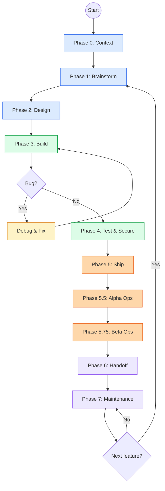

The framework follows a philosophy of progressive formality: early phases encourage exploration and divergent thinking, middle phases enforce structure and discipline through agents and automated checks, and later phases focus on resilience, documentation, and long-term sustainability. You move forward through phases, but the lifecycle is a loop — maintenance feeds back into brainstorming whenever new requirements emerge.

---

## Phase 0: Context

AI assistants start every session with amnesia. Phase 0 exists to re-establish state so the assistant understands what the project is, what has been built, what conventions are in use, and where things live. Without this phase, every session begins with the assistant guessing — and guessing wrong.

For new projects, five skills scaffold the initial structure: `new_project` selects a blueprint and initializes the repository, `project_context` generates the AI onboarding template, `ssot_structure` creates the single-source-of-truth folder layout, `documentation_framework` establishes documentation conventions, and `project_guidelines` codifies coding standards into enforceable rules.

For existing projects, ten skills help the assistant build a mental model of what already exists — designed for the common scenario where you bring an AI assistant into a codebase it has never seen. See [EXISTING_PROJECT_GUIDE.md](EXISTING_PROJECT_GUIDE.md) for the full onboarding workflow. Both skill sets can be used together when a new project inherits a legacy codebase.

| Skill | What It Does | Trigger |
|-------|-------------|---------|
| `new_project` | Select blueprint, scaffold repo structure | Starting a greenfield project |
| `project_context` | Generate AI onboarding template with key decisions | First session setup |
| `ssot_structure` | Create `.agent/` folder layout and SSOTs | Project initialization |
| `documentation_framework` | Establish doc conventions and templates | After SSOT creation |
| `project_guidelines` | Codify coding standards into rules files | After framework setup |
| `codebase_navigation` | Index file structure, entry points, key modules | Joining any existing project |
| `search_first` | Search before generating — prevent hallucinated code | Every coding session |
| `architecture_recovery` | Reverse-engineer architecture from code | Existing project with no docs |
| `tech_debt_assessment` | Quantify technical debt with business impact scores | Inherited codebase evaluation |
| `codebase_health_audit` | Automated quality, security, and dependency baseline | First week on existing project |
| `legacy_modernization` | Incremental modernization strategies | Codebase older than 2 years |
| `team_knowledge_transfer` | Structured knowledge extraction from team members | Onboarding or team transitions |
| `system_design_review` | Evaluate scalability and fault tolerance | Architecture assessment |
| `infrastructure_audit` | Map deployment topology and infrastructure state | Ops handover or audit |
| `incident_history_review` | Analyze past incidents and failure modes | Post-onboarding risk assessment |

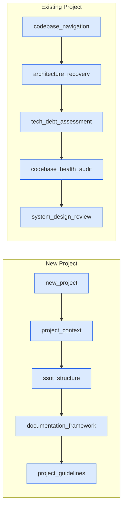

---

## Phase 1: Brainstorm

Raw ideas are worthless until structured into specs with priorities. Phase 1 transforms brain dumps, client conversations, and market observations into structured documents that downstream phases can act on. The `idea_to_spec` skill is the workhorse here — it takes unstructured input and produces a full specification with cross-AI validation. For client projects, `client_discovery` and `proposal_generator` handle intake and deliverable scoping. The PM-oriented skills (`prioritization_frameworks`, `user_story_standards`, `competitive_analysis`, `product_metrics`, `user_research`) ensure that what gets built is what should get built.

| Skill | What It Does | Trigger |
|-------|-------------|---------|
| `idea_to_spec` | Transform brain dump into structured specification | New feature or product idea |
| `client_discovery` | Structured client intake questionnaire | Client project kickoff |
| `proposal_generator` | Generate scoped proposal from discovery output | After client discovery |
| `smb_launchpad` | Rapid MVP scoping for small businesses | SMB client engagement |
| `prioritization_frameworks` | RICE, MoSCoW, Kano scoring for backlog prioritization | Backlog grooming |
| `user_story_standards` | User stories with Gherkin and acceptance criteria | Sprint planning |
| `competitive_analysis` | Competitor mapping and feature gap analysis | Market research phase |
| `product_metrics` | North Star metric, AARRR funnel, KPI hierarchy | Product strategy definition |
| `user_research` | Interview scripts, persona development, journey maps | User understanding |

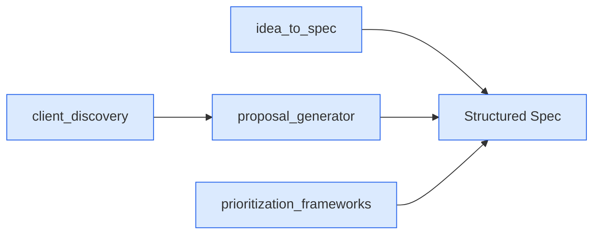

---

## Phase 2: Design

Code without architecture accrues debt faster than it ships value. Phase 2 takes the structured spec from Phase 1 and produces an architecture that balances first-principles decomposition with practical deployment constraints. The `atomic_reverse_architecture` skill breaks features into atoms from both forward and reverse directions. `schema_standards` and `feature_architecture` handle data modeling and system design. `deployment_modes` ensures the architecture supports cloud, hybrid, or sovereign deployment from day one — not as a retrofit. The **planner** and **architect** agents work together via `/plan` to produce implementation plans that Phase 3 can execute.

| Skill | What It Does | Trigger |
|-------|-------------|---------|
| `atomic_reverse_architecture` | First-principles + reverse decomposition into atoms | Feature design start |
| `schema_standards` | Data model design with naming and relationship conventions | Database design |
| `feature_architecture` | System architecture for feature modules | After atom decomposition |
| `deployment_modes` | Cloud/hybrid/sovereign deployment architecture | Infrastructure planning |

Agents and commands: **planner** agent + **architect** agent, invoked via `/plan`.

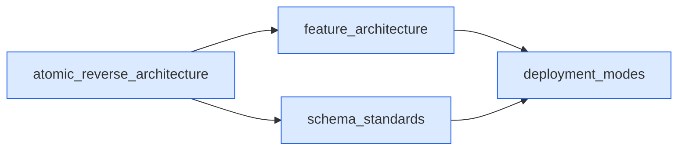

---

## Phase 3: Build

Most AI-assisted projects fail in this phase. Without TDD discipline, entropy checks, and review automation, generated code drifts from the spec, accumulates silent bugs, and becomes unmaintainable within weeks. Eight agents operate here — more than any other phase — because implementation is where the framework earns its keep. The `spec_build` skill orchestrates a 12-phase build process. The `tdd_workflow` skill ensures tests are written before code. Language-specific patterns (`golang_patterns`, `python_patterns`, `springboot_patterns`, `django_patterns`, and others) encode idioms that prevent AI-generated slop. The `code_review` and `refactoring` skills, backed by dedicated agents, enforce quality gates that no human reviewer could sustain at AI coding speed.

| Skill | What It Does | Trigger |
|-------|-------------|---------|
| `spec_build` | 12-phase implementation orchestrator | Feature build start |
| `tdd_workflow` | Test-first development with red-green-refactor | Every code change |
| `bug_troubleshoot` | Structured debugging with root cause analysis | Build failure or bug |
| `code_review` | Automated code review with quality scoring | After implementation |
| `refactoring` | Safe refactoring with behavior preservation | Code smell detection |
| `observability` | Golden Signals monitoring and structured logging | After core build |
| `ui_polish` | 10-point UI quality checklist | Before feature complete |
| `website_build` | Anti-AI-slop web development standards | Website projects |
| `code_changelog` | Document changes with context and rationale | After every task |
| `git_workflow`, `api_design`, `error_handling`, `auth_implementation` | Workflow, API, error, and auth conventions | Ongoing |
| `docker_development`, `environment_setup` | Container workflow and dev bootstrapping | Project start |
| 16 language-specific | `backend_patterns`, `frontend_patterns`, `golang_patterns`, `python_patterns`, `cpp_coding_standards`, `java_coding_standards`, `springboot_patterns`, `django_patterns`, `swift_*` (3), and 5 more | Per-language work |
| 4 PM skills | `sprint_planning`, `stakeholder_communication`, `retrospective`, `cost_estimation` | Sprint ceremonies |

Agents and commands: **code-reviewer** (`/code-review`), **tdd-guide** (`/tdd`), **build-error-resolver** (`/build-fix`), **refactor-cleaner** (`/refactor-clean`), **database-reviewer** (manual), **go-reviewer** (`/go-review`), **go-build-resolver** (`/go-build`), **python-reviewer** (`/python-review`). Multi-agent: `/multi-backend`, `/multi-frontend`.

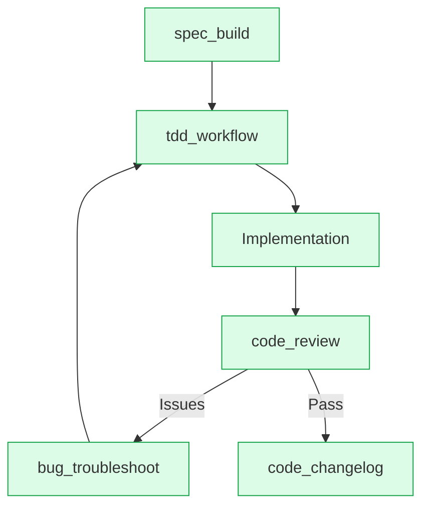

---

## Phase 4: Test & Secure

Vulnerabilities found post-launch cost 10-100x more to fix than those caught during development. Phase 4 applies security auditing, comprehensive testing, and IP protection before any code reaches users. The testing skills cover the full pyramid: `unit_testing` and `integration_testing` at the base, `e2e_testing` with Playwright/Cypress in the middle, and `performance_testing` with k6 and Lighthouse at the top. Framework-specific variants (`springboot_tdd`, `django_tdd`, `golang_testing`, `python_testing`, `cpp_testing`) ensure idiomatic test patterns per stack.

| Skill | What It Does | Trigger |
|-------|-------------|---------|
| `security_audit` | OWASP Top 10 audit with remediation guidance | Pre-ship security review |
| `e2e_testing` | Browser automation with Playwright/Cypress | Feature complete |
| `unit_testing` | Jest/Vitest patterns with mocking and coverage | Every code change |
| `integration_testing` | API integration tests with Supertest | After endpoint creation |
| `accessibility_testing` | WCAG AA compliance with axe-core | Before release |
| `performance_testing` | k6 load tests, Lighthouse CI, Core Web Vitals | Before beta/GA |
| `tdd_workflow` | Red-green-refactor enforcement | Ongoing |
| `verification_loop` | Multi-pass verification of implementation | After build |
| `eval_harness` | Evaluation framework for AI-generated output | AI feature testing |
| `ip_protection` | Patent, trademark, license compliance checks | Before public release |
| Framework-specific | `golang_testing`, `python_testing`, `cpp_testing`, `springboot_tdd`, `springboot_verification`, `springboot_security`, `django_security`, `django_tdd`, `django_verification` | Per-framework work |

Agents and commands: **security-reviewer** (manual), **e2e-runner** (`/e2e`), **tdd-guide** (`/tdd`). Commands: `/verify`, `/test-coverage`, `/eval`.

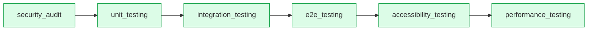

---

## Phase 5: Ship

Deployment is not `git push` — it is migrations, CI/CD pipelines, legal pages, seed data, and infrastructure-as-code that must all align before the first user sees anything. Phase 5 handles the operational prerequisites that separate a working dev environment from a production-ready system. `db_migrations` ensures safe schema changes with rollback plans, `ci_cd_pipeline` generates GitHub Actions workflows, and `deployment_patterns` provides blue-green, canary, and rolling strategies.

| Skill | What It Does | Trigger |
|-------|-------------|---------|
| `db_migrations` | Safe schema migration with rollback plans | Before deploy |
| `infrastructure_as_code` | Docker/Terraform infrastructure definitions | Infrastructure setup |
| `ci_cd_pipeline` | GitHub Actions CI/CD with caching and deploy | Pipeline creation |
| `website_launch` | Pre-launch go-live checklist | Before launch |
| `legal_compliance` | ToS, Privacy Policy, GDPR/CCPA checklists | Before public access |
| `seed_data` | Idempotent demo data with faker.js | Staging setup |
| `deployment_patterns` | Blue-green, canary, rolling deployment strategies | Production deploy |
| Domain-specific | `saas_billing`, `oss_publishing`, `desktop_publishing`, `mobile_publishing` | Per-domain |

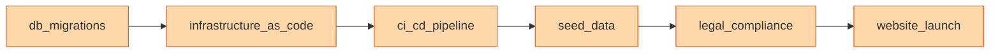

---

## Phase 5.5: Alpha Ops

The gap between "works locally" and "users can rely on it" is where most projects silently fail. Alpha Ops instruments the application for real-world operation before external users arrive. Error tracking captures crashes that localhost never reveals, health checks enable proper load balancer routing, and environment validation prevents the "works on my machine" class of deployment failures.

| Skill | What It Does | Trigger |
|-------|-------------|---------|
| `error_tracking` | Sentry integration for NestJS + React + Next.js | First staging deploy |
| `health_checks` | Liveness/readiness endpoints with @nestjs/terminus | Infrastructure setup |
| `env_validation` | Fail-fast startup with env var validation | Before first deploy |
| `qa_playbook` | Manual test procedures with severity classification | Before alpha invite |
| `backup_strategy` | Automated pg_dump, PITR, restore verification | Before production data |

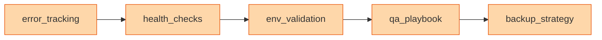

---

## Phase 5.75: Beta Ops

Beta is where real users generate real data and real complaints. Phase 5.75 adds the instrumentation and resilience needed to learn from beta users without losing them. Product analytics reveals what users actually do versus what you assumed. Rate limiting protects the system from abuse. Error boundaries keep the UI functional when backend calls fail.

| Skill | What It Does | Trigger |
|-------|-------------|---------|
| `product_analytics` | PostHog integration with event taxonomy | Before beta invite |
| `feedback_system` | In-app bug reporter with triage workflow | Before beta invite |
| `rate_limiting` | @nestjs/throttler with plan-based tiers | Before public access |
| `error_boundaries` | React error boundaries with toast system | Before beta invite |
| `email_templates` | React Email + Resend branded templates | Before beta invite |
| `feature_flags` | Gradual rollout, A/B testing, kill switches | Beta rollout |

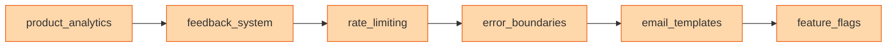

---

## Phase 6: Handoff

Without documentation, you are the permanent bottleneck. Phase 6 produces the artifacts that let other developers, clients, and end users operate without you. Feature walkthroughs explain what was built in plain English, the API reference generates Swagger/OpenAPI docs, and the disaster recovery runbook ensures that when things break at 3 AM, the on-call engineer knows what to do.

| Skill | What It Does | Trigger |
|-------|-------------|---------|
| `feature_walkthrough` | Plain English feature documentation | After feature complete |
| `api_reference` | Swagger/OpenAPI documentation generation | After API stabilization |
| `doc_reorganize` | Content audit and documentation cleanup | Before handoff |
| `user_documentation` | Help center content and contextual tooltips | Before GA |
| `disaster_recovery` | 8-scenario runbook with incident response | Before GA |
| `community_management` | Community channels, contribution guidelines | Open source projects |

Agents and commands: **doc-updater** (`/update-docs`, `/update-codemaps`).

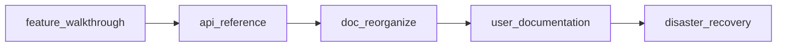

---

## Phase 7: Maintenance

Software is never done. Phase 7 keeps the project healthy after launch through continuous documentation updates, dependency audits, and structured learning. The `continuous_learning` skill, powered by `/learn` and `/evolve`, lets the framework itself improve from experience — codifying new patterns discovered during real project work into reusable skills and instincts.

| Skill | What It Does | Trigger |
|-------|-------------|---------|
| `ssot_update` | Keep single source of truth current | After every significant change |
| `documentation_standards` | SOP/WI/Schema documentation enforcement | Ongoing |
| `sop_standards` | Standard Operating Procedure templates | Process documentation |
| `wi_standards` | Work Instruction templates | Task documentation |
| `dependency_management` | npm audit, license check, Dependabot config | Monthly or on alert |
| `continuous_learning` | Learn from experience, evolve framework skills | Ongoing |

Agents and commands: `/learn`, `/evolve`, `/instinct-status`, `/instinct-export`, `/instinct-import`, `/checkpoint`, `/sessions`.

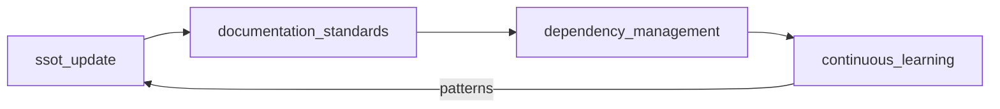

---

## Toolkit (Cross-Phase)

Toolkit skills are phase-independent utilities that support the lifecycle without belonging to a single phase. The Adversarial Gap Engine runs 25-loop analysis cycles to find what the framework itself is missing. Content production skills turn one piece of content into thirty. The `strategic_compact` and `iterative_retrieval` skills manage context windows during long sessions. The `cost_aware_llm_pipeline` skill optimizes token spend across multi-model workflows.

| Skill | What It Does | Trigger |
|-------|-------------|---------|
| `ceo_brain` | Strategic decision-making framework | Executive planning |
| `adversarial_gap_engine` | 25-loop framework gap analysis | Framework audits |
| `video_research` | Video content research and analysis | Content planning |
| `content_creation` | Long-form content production | Marketing |
| `content_waterfall` | 1 video to 30 clips pipeline | Content repurposing |
| `personal_brand` | Personal branding strategy | Brand building |
| `ai_tool_orchestration` | Multi-AI tool selection and workflow | Tool evaluation |
| `strategic_compact` | Context window management for long sessions | Session management |
| `iterative_retrieval` | Multi-pass information retrieval | Research tasks |
| `cost_aware_llm_pipeline` | Token cost optimization across models | Cost management |

Commands: `/checkpoint`, `/sessions`, `/orchestrate`, `/multi-execute`.

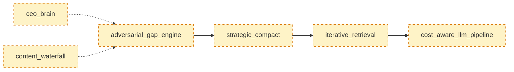

---

## Adapting the Lifecycle

The lifecycle is not rigid — it is a menu, not a mandate. A weekend MVP skips Phases 4 through 5.75 entirely. An enterprise SaaS product uses every phase and adds domain-specific skills. The key is knowing what you are skipping and why, so you can come back to it when the project matures.

The following tables show which phases to emphasize and which to defer based on project type and blueprint category.

### By Project Type

| Project Type | Phases to Emphasize | Phases to Defer | Notes |
|-------------|--------------------|--------------------|-------|
| SaaS Application | All phases | None | Full lifecycle with billing, multi-tenancy, analytics |
| Client Website | 0-3, 5, 6 | 5.5, 5.75 | Client discovery and handoff are critical |
| Open Source Tool | 0-4, 6, 7 | Legal (use MIT), billing | Community management becomes important |
| Internal Tool | 0-3, 5, 7 | Legal, marketing, analytics | SOPs and WIs for team adoption |
| MVP / Prototype | 0-3 | 4, 5.5, 5.75 | Speed to users, iterate from feedback |
| API / Microservice | 0-5 (skip frontend) | UI skills | API docs, integration tests, load tests |
| Desktop App | All + deployment modes | Web-specific skills | Packaging and distribution added |

### By Blueprint Category

Each blueprint category adds domain-specific skills on top of the core lifecycle. See [BLUEPRINT_GUIDE.md](BLUEPRINT_GUIDE.md) for full details.

| Blueprint Category | Domain Skills Added |
|-------------------|-------------------|
| 01 — Web & Apps | Core lifecycle + `desktop_publishing` |
| 02 — Games | `game_development`, `multiplayer_systems`, `game_publishing` |
| 03 — Trading & Finance | `trading_systems`, `financial_compliance` |
| 04 — Web3 & Blockchain | `smart_contract_dev`, `dapp_development`, `web3_security` |
| 05 — AI & ML | `ml_pipeline`, `prompt_engineering`, `mlops` |
| 06 — Hardware & IoT | `firmware_development`, `iot_platform` |
| 07 — Automation & DevOps | `ci_cd_pipeline`, `infrastructure_as_code`, `observability` |
| 08 — Plugins & Extensions | `extension_development` |
| 09 — Data & Analytics | `etl_pipeline`, `data_warehouse`, `dashboard_development` |

---

## Framework Structure

```
ai-dev-workflow-framework/
├── MASTER-LIFECYCLE.md          <- This file
├── README.md
├── CLIENT_LIFECYCLE_GUIDE.md
├── BLUEPRINT_GUIDE.md
├── EXISTING_PROJECT_GUIDE.md
├── LICENSE
├── .agent/
│   ├── GETTING_STARTED.md
│   ├── README.md
│   ├── skills-index.md
│   ├── install.sh
│   ├── agents/                  (13 agents)
│   ├── commands/                (32 commands)
│   ├── rules/                   (25 rules)
│   │   ├── common/              (9 rules)
│   │   ├── typescript/          (5 rules)
│   │   ├── python/              (5 rules)
│   │   ├── golang/              (5 rules)
│   │   └── swift/               (5 rules)
│   ├── hooks/                   (hooks.json + scripts)
│   ├── contexts/                (3 dynamic contexts)
│   ├── scripts/
│   │   ├── hooks/               (9 hook scripts)
│   │   ├── ci/                  (5 validators)
│   │   └── lib/                 (8 utility files)
│   ├── schemas/                 (3 validation schemas)
│   ├── examples/                (6 CLAUDE.md templates)
│   ├── mcp-configs/             (MCP server configs)
│   ├── skills/
│   │   ├── 0-context/           (15 skills)
│   │   ├── 1-brainstorm/        (9 skills)
│   │   ├── 2-design/            (4 skills)
│   │   ├── 3-build/             (50 skills)
│   │   ├── 4-secure/            (21 skills)
│   │   ├── 5-ship/              (11 skills)
│   │   ├── 5.5-alpha/           (5 skills)
│   │   ├── 5.75-beta/           (6 skills)
│   │   ├── 6-handoff/           (6 skills)
│   │   ├── 7-maintenance/       (6 skills)
│   │   └── toolkit/             (9 skills)
│   ├── workflows/
│   │   ├── 0-context.md through 7-maintenance.md
│   │   ├── alpha-release.md
│   │   ├── beta-release.md
│   │   └── toolkit/             (8 workflows)
│   ├── docs/
│   │   ├── 0-context/ through 7-maintenance/
│   │   ├── toolkit/
│   │   └── sops/                (5 SOPs)
│   └── blueprints/              (9 categories)
```

---

*Framework v9.0 — 228 Skills | 13 Agents | 32 Commands | 25 Rules | 18 Workflows | 70+ Docs*
