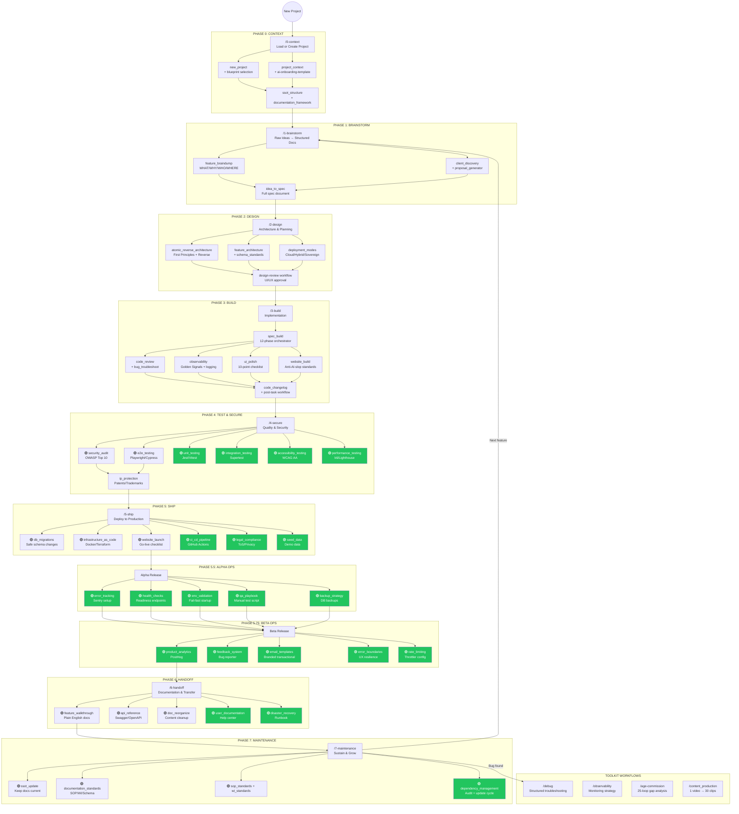

# AI Development Workflow Framework — Master Lifecycle

## The Complete Journey: Idea → Production → Growth

This document is the single source of truth for the entire framework. It maps every skill, workflow, and document to the correct phase, identifies what's missing, and shows the correct order for ALL projects.

---

## The Full Lifecycle (Mermaid)



---

## Current Framework Inventory

### What EXISTS (40 skills, 16 workflows, 38 docs)

| Phase | Skills | Workflows | Docs |
|-------|--------|-----------|------|
| **0-Context** | documentation_framework, new_project, project_context, ssot_structure | 0-context, new-project | ai-onboarding templates (2), glossary, master-workflow-guide, project-workflow-checklist |
| **1-Brainstorm** | client_discovery, feature_braindump, gemini_handoff, idea_to_spec, proposal_generator, smb_launchpad | 1-brainstorm | client-discovery-template, proposal-template |
| **2-Design** | atomic_reverse_architecture, deployment_modes, feature_architecture, schema_standards | 2-design, design-review | ara-template, frontend-architect-standards, tech-stack-guide |
| **3-Build** | spec_build, bug_troubleshoot, claude_verification, code_changelog, code_review, observability, ui_polish, website_build | 3-build, debug, post-task | code-snippets, common-mistakes, project-templates, prompt-library, skill-combos, website-build-checklist |
| **4-Secure** | security_audit, e2e_testing, ip_protection | 4-secure | security-audit-template |
| **5-Ship** | db_migrations, infrastructure_as_code, website_launch | 5-ship, launch | industry-compliance-ref, website-launch-checklist-template |
| **6-Handoff** | api_reference, doc_reorganize, feature_walkthrough | 6-handoff | feature-walkthrough-template |
| **7-Maintenance** | documentation_standards, sop_standards, wi_standards, ssot_update | 7-maintenance | ssot-master-index, SOPs (5) |
| **Toolkit** | ceo_brain, adversarial_gap_engine, video_research, content_creation, content_waterfall, personal_brand | content_production, age-commission, observability | long-form-video-protocol |

**Totals**: 40 skills, 16 workflows, 38 documents

---

## GAP ANALYSIS: What's MISSING

The framework covers **Idea → Build → Deploy** extremely well. But it stops at deployment. Everything needed to **Operate → Scale → Maintain in production** is either missing or only partially covered.

### Missing Skills (20 new skills needed)

| # | Proposed Skill | Phase | What It Does | Priority |
|---|----------------|-------|-------------|----------|
| 1 | **unit_testing** | 4-secure | Jest/Vitest unit test patterns, mocking strategies, coverage targets | P0 |
| 2 | **integration_testing** | 4-secure | Supertest API tests, test DB setup, auth token generation for tests | P0 |
| 3 | **accessibility_testing** | 4-secure | WCAG AA checklist, axe-core setup, keyboard nav testing, screen reader testing | P1 |
| 4 | **performance_testing** | 4-secure | k6 load test scripts, Lighthouse scores, performance budgets, bundle analysis | P1 |
| 5 | **ci_cd_pipeline** | 5-ship | GitHub Actions templates (lint → test → build → deploy), secrets management | P0 |
| 6 | **legal_compliance** | 5-ship | ToS/Privacy Policy/Cookie Policy/AUP templates, GDPR/CCPA checklist | P0 |
| 7 | **seed_data** | 5-ship | Prisma seed scripts, demo data strategy, idempotent seeding patterns | P1 |
| 8 | **error_tracking** | 5.5-alpha | Sentry setup (backend NestJS + frontend React + website Next.js), source maps | P0 |
| 9 | **health_checks** | 5.5-alpha | @nestjs/terminus, liveness/readiness/detailed endpoints, monitoring integration | P0 |
| 10 | **env_validation** | 5.5-alpha | Startup validation, fail-fast on missing vars, .env.example maintenance | P1 |
| 11 | **qa_playbook** | 5.5-alpha | Manual test case templates per feature type, regression checklist, severity classification | P1 |
| 12 | **backup_strategy** | 5.5-alpha | Supabase backup config, pg_dump scripts, restore verification, PITR setup | P0 |
| 13 | **product_analytics** | 5.75-beta | PostHog setup (backend + frontend), event taxonomy, user identification, dashboards | P1 |
| 14 | **feedback_system** | 5.75-beta | In-app bug reporter component, feedback API endpoint, triage workflow | P1 |
| 15 | **email_templates** | 5.75-beta | Branded HTML email templates (welcome, invite, reset, receipt, warning, trial) | P1 |
| 16 | **error_boundaries** | 5.75-beta | React error boundaries, toast notification system, graceful degradation patterns | P1 |
| 17 | **rate_limiting** | 5.75-beta | @nestjs/throttler config, per-endpoint limits, skip patterns, auth endpoint hardening | P1 |
| 18 | **user_documentation** | 6-handoff | In-app help center, contextual tooltips, FAQ templates, external docs site | P2 |
| 19 | **disaster_recovery** | 6-handoff | Runbook templates for 8+ failure scenarios, emergency contacts, maintenance schedule | P0 |
| 20 | **dependency_management** | 7-maintenance | npm audit workflow, license checking, update cadence, breaking change handling | P2 |

### Missing Documents (8 new docs needed)

| # | Document | Phase Folder | What It Contains |
|---|----------|-------------|-----------------|
| 1 | **unit-test-patterns.md** | 4-secure | Testing patterns by framework (NestJS, React), mocking Prisma, test utilities |
| 2 | **ci-cd-templates.md** | 5-ship | GitHub Actions YAML for mono-repo (backend + frontend + website), deploy workflows |
| 3 | **legal-page-templates.md** | 5-ship | Customizable ToS, Privacy Policy, Cookie Policy, AUP content |
| 4 | **alpha-readiness-checklist.md** | 5-ship | Pre-alpha checklist (Sentry, health, env, backups, logging) |
| 5 | **beta-readiness-checklist.md** | 5-ship | Pre-beta checklist (tests, legal, analytics, rate limits, a11y, seed data) |
| 6 | **ga-readiness-checklist.md** | 5-ship | Pre-GA checklist (load tests, WCAG, CI/CD, docs, DR, performance) |
| 7 | **disaster-recovery-template.md** | 6-handoff | Template for DR runbooks with scenario-based recovery procedures |
| 8 | **analytics-event-taxonomy.md** | 5-ship | Standard event naming, required properties per event, dashboard templates |

### Missing Workflows (2 new workflows needed)

| # | Workflow | Slash Command | What It Does |
|---|----------|--------------|-------------|
| 1 | **alpha-release** | `/alpha` | Runs through Alpha readiness: error tracking → health checks → env validation → QA playbook → backup verification → structured logging |
| 2 | **beta-release** | `/beta` | Runs through Beta readiness: tests → legal → API docs → rate limiting → bug reporter → analytics → error boundaries → accessibility → seed data → email templates → security verification |

**GA release** doesn't need its own workflow — it's `/launch` (already exists) expanded with the GA checklist.

---

## The Correct Order for ALL Projects

```mermaid
graph LR
    subgraph "PLAN"
        A1["0-Context<br/>Load project"] --> A2["1-Brainstorm<br/>Structure ideas"]
        A2 --> A3["2-Design<br/>Architecture"]
    end

    subgraph "BUILD"
        A3 --> B1["3-Build<br/>Implement"]
        B1 --> B2["post-task<br/>Document"]
        B2 --> |"more features"| B1
    end

    subgraph "VERIFY"
        B2 --> C1["4-Secure<br/>Security audit"]
        C1 --> C2["Unit + Integration<br/>Tests ✅"]
        C2 --> C3["E2E Tests"]
        C3 --> C4["Accessibility<br/>Testing ✅"]
    end

    subgraph "DEPLOY"
        C4 --> D1["5-Ship<br/>CI/CD + Legal ✅"]
        D1 --> D2["Seed Data ✅"]
        D2 --> D3["Deploy to<br/>Staging"]
    end

    subgraph "ALPHA"
        D3 --> E1["Error Tracking ✅"]
        E1 --> E2["Health Checks ✅"]
        E2 --> E3["Env Validation ✅"]
        E3 --> E4["Backup Verify ✅"]
        E4 --> E5["QA Playbook ✅"]
        E5 --> E6["Manual Testing"]
    end

    subgraph "BETA"
        E6 --> F1["Analytics ✅"]
        F1 --> F2["Bug Reporter ✅"]
        F2 --> F3["Rate Limiting ✅"]
        F3 --> F4["Error Boundaries ✅"]
        F4 --> F5["Email Templates ✅"]
        F5 --> F6["Invite Beta Users"]
    end

    subgraph "GA"
        F6 --> G1["Load Testing ✅"]
        G1 --> G2["WCAG Audit ✅"]
        G2 --> G3["User Docs ✅"]
        G3 --> G4["DR Runbook ✅"]
        G4 --> G5["Performance<br/>Budget ✅"]
        G5 --> G6["🚀 Public Launch"]
    end

    subgraph "OPERATE"
        G6 --> H1["6-Handoff<br/>Docs + API ref"]
        H1 --> H2["7-Maintenance<br/>Bug fixes + updates"]
        H2 --> |"new feature"| A2
    end

    style C2 fill:#22c55e,color:#fff
    style C4 fill:#22c55e,color:#fff
    style D1 fill:#22c55e,color:#fff
    style D2 fill:#22c55e,color:#fff
    style E1 fill:#22c55e,color:#fff
    style E2 fill:#22c55e,color:#fff
    style E3 fill:#22c55e,color:#fff
    style E4 fill:#22c55e,color:#fff
    style E5 fill:#22c55e,color:#fff
    style F1 fill:#22c55e,color:#fff
    style F2 fill:#22c55e,color:#fff
    style F3 fill:#22c55e,color:#fff
    style F4 fill:#22c55e,color:#fff
    style F5 fill:#22c55e,color:#fff
    style G1 fill:#22c55e,color:#fff
    style G2 fill:#22c55e,color:#fff
    style G3 fill:#22c55e,color:#fff
    style G4 fill:#22c55e,color:#fff
    style G5 fill:#22c55e,color:#fff
```



**Legend**: 🟢 = All skills complete — framework is at 100%

---

## Phase-by-Phase: What to Invoke

### For EVERY project, follow this exact sequence

#### PHASE 0: CONTEXT (Project Setup)

```
/new-project   OR   /0-context (if resuming)
```

| Step | Skill/Workflow | Status |
|------|---------------|--------|
| Pick blueprint | `new_project` + blueprint library | 🟢 Exists |
| Set up .agent folder | `ssot_structure` + `documentation_framework` | 🟢 Exists |
| Create project context | `project_context` + onboarding template | 🟢 Exists |

#### PHASE 1: BRAINSTORM (Requirements)

```
/1-brainstorm
```

| Step | Skill/Workflow | Status |
|------|---------------|--------|
| Structure raw ideas | `feature_braindump` | 🟢 Exists |
| Client intake (if client project) | `client_discovery` → `proposal_generator` | 🟢 Exists |
| Create full spec | `idea_to_spec` | 🟢 Exists |
| Cross-AI validation | `gemini_handoff` | 🟢 Exists |

#### PHASE 2: DESIGN (Architecture)

```
/2-design
```

| Step | Skill/Workflow | Status |
|------|---------------|--------|
| Decompose into atoms | `atomic_reverse_architecture` | 🟢 Exists |
| Design data models | `schema_standards` | 🟢 Exists |
| Plan architecture | `feature_architecture` | 🟢 Exists |
| Verify deployment modes | `deployment_modes` | 🟢 Exists |
| Review UI/UX | `/design-review` workflow | 🟢 Exists |
| Threat modeling | `security_audit` (shift-left) | 🟢 Exists |

#### PHASE 3: BUILD (Implementation)

```
/3-build
```

| Step | Skill/Workflow | Status |
|------|---------------|--------|
| Orchestrate feature build | `spec_build` (12-phase) | 🟢 Exists |
| Polish UI | `ui_polish` | 🟢 Exists |
| Review code | `code_review` | 🟢 Exists |
| Set up monitoring | `observability` | 🟢 Exists |
| Debug issues | `/debug` workflow | 🟢 Exists |
| Document changes | `code_changelog` + `/post-task` | 🟢 Exists |

#### PHASE 4: TEST & SECURE

```
/4-secure
```

| Step | Skill/Workflow | Status |
|------|---------------|--------|
| Security audit (OWASP) | `security_audit` | 🟢 Exists |
| E2E browser tests | `e2e_testing` | 🟢 Exists |
| IP protection check | `ip_protection` | 🟢 Exists |
| **Unit tests** | `unit_testing` | 🟢 **Created** |
| **Integration tests** | `integration_testing` | 🟢 **Created** |
| **Accessibility audit** | `accessibility_testing` | 🟢 **Created** |
| **Load/performance tests** | `performance_testing` | 🟢 **Created** |

#### PHASE 5: SHIP (Deploy)

```
/5-ship
```

| Step | Skill/Workflow | Status |
|------|---------------|--------|
| Run migrations | `db_migrations` | 🟢 Exists |
| Set up infrastructure | `infrastructure_as_code` | 🟢 Exists |
| Pre-launch checklist | `website_launch` | 🟢 Exists |
| **CI/CD pipeline** | `ci_cd_pipeline` | 🟢 **Created** |
| **Legal pages** | `legal_compliance` | 🟢 **Created** |
| **Seed data** | `seed_data` | 🟢 **Created** |

#### PHASE 5.5: ALPHA OPS (First Users)

```
/alpha (NEW WORKFLOW NEEDED)
```

| Step | Skill/Workflow | Status |
|------|---------------|--------|
| **Error tracking (Sentry)** | `error_tracking` | 🟢 **Created** |
| **Health check endpoints** | `health_checks` | 🟢 **Created** |
| **Env var validation** | `env_validation` | 🟢 **Created** |
| **QA test playbook** | `qa_playbook` | 🟢 **Created** |
| **Backup verification** | `backup_strategy` | 🟢 **Created** |
| Structured logging | `observability` (partial) | 🟡 Partial |

#### PHASE 5.75: BETA OPS (External Users)

```
/beta (NEW WORKFLOW NEEDED)
```

| Step | Skill/Workflow | Status |
|------|---------------|--------|
| **Product analytics** | `product_analytics` | 🟢 **Created** |
| **In-app bug reporter** | `feedback_system` | 🟢 **Created** |
| **Rate limiting config** | `rate_limiting` | 🟢 **Created** |
| **Error boundaries + toasts** | `error_boundaries` | 🟢 **Created** |
| **Email templates** | `email_templates` | 🟢 **Created** |

#### PHASE 6: HANDOFF (Documentation & GA)

```
/6-handoff   +   /launch
```

| Step | Skill/Workflow | Status |
|------|---------------|--------|
| Feature walkthroughs | `feature_walkthrough` | 🟢 Exists |
| API documentation | `api_reference` | 🟢 Exists |
| Doc cleanup | `doc_reorganize` | 🟢 Exists |
| Client handoff (if applicable) | `/6-handoff` workflow | 🟢 Exists |
| **User-facing help center** | `user_documentation` | 🟢 **Created** |
| **Disaster recovery runbook** | `disaster_recovery` | 🟢 **Created** |
| Go live | `/launch` workflow | 🟢 Exists |

#### PHASE 7: MAINTENANCE (Operate & Grow)

```
/7-maintenance
```

| Step | Skill/Workflow | Status |
|------|---------------|--------|
| SSoT updates | `ssot_update` | 🟢 Exists |
| SOP/WI/Schema docs | `documentation_standards`, `sop_standards`, `wi_standards` | 🟢 Exists |
| Bug fixing | `/debug` + `/7-maintenance` workflows | 🟢 Exists |
| **Dependency audit cycle** | `dependency_management` | 🟢 **Created** |

---

## Summary Scorecard

```
FRAMEWORK COMPLETENESS BY PHASE:

Phase 0: Context       ████████████████████ 100% — Perfect
Phase 1: Brainstorm    ████████████████████ 100% — Perfect
Phase 2: Design        ████████████████████ 100% — Perfect
Phase 3: Build         ████████████████████ 100% — Perfect
Phase 4: Test/Secure   ████████████████████ 100% — Complete ✅ (was 50%)
Phase 5: Ship          ████████████████████ 100% — Complete ✅ (was 50%)
Phase 5.5: Alpha Ops   ████████████████████ 100% — Complete ✅ (was 0%)
Phase 5.75: Beta Ops   ████████████████████ 100% — Complete ✅ (was 0%)
Phase 6: Handoff       ████████████████████ 100% — Complete ✅ (was 60%)
Phase 7: Maintenance   ████████████████████ 100% — Complete ✅ (was 80%)
Toolkit                ████████████████████ 100% — Perfect

OVERALL: 100% complete ✅

BEFORE: Idea → Build → Basic Deploy (~65%)
AFTER:  Idea → Build → Deploy → Alpha → Beta → GA → Maintain (100%)
```

---

## What Was Added (February 2026)

### 20 New Skills (all created)

**Wave 1 — Must-Have (before any project ships):**

1. ✅ `unit_testing` — Jest/Vitest patterns, mocking, coverage targets
2. ✅ `integration_testing` — Supertest API tests, org-scoping verification
3. ✅ `ci_cd_pipeline` — GitHub Actions, mono-repo, caching, deploy
4. ✅ `error_tracking` — Sentry for NestJS + React + Next.js
5. ✅ `health_checks` — @nestjs/terminus, liveness/readiness endpoints
6. ✅ `backup_strategy` — pg_dump, PITR, automated restore verification
7. ✅ `legal_compliance` — ToS, Privacy, Cookies, GDPR/CCPA checklists
8. ✅ `disaster_recovery` — 8-scenario runbook templates, incident response

**Wave 2 — Should-Have (before beta users):**
9. ✅ `rate_limiting` — @nestjs/throttler, plan-based tiers, Redis
10. ✅ `error_boundaries` — React boundaries, toast system, offline detection
11. ✅ `qa_playbook` — Manual test procedures, severity classification
12. ✅ `env_validation` — class-validator startup checks, .env.example
13. ✅ `feedback_system` — In-app bug reporter, triage workflow
14. ✅ `email_templates` — React Email + Resend, 8 branded templates
15. ✅ `accessibility_testing` — WCAG AA, axe-core, keyboard nav, ARIA

**Wave 3 — Nice-to-Have (before GA):**
16. ✅ `product_analytics` — PostHog, event taxonomy, feature flags
17. ✅ `performance_testing` — k6 load tests, Lighthouse CI, Core Web Vitals
18. ✅ `seed_data` — Prisma seeding, idempotent, faker.js, env-aware
19. ✅ `user_documentation` — Help center, contextual tooltips, user guides
20. ✅ `dependency_management` — npm audit, license checking, Dependabot

### 2 New Workflows

- ✅ `/alpha` — Alpha release readiness (6 steps)
- ✅ `/beta` — Beta release readiness (11 steps)

### 8 New Documents

- ✅ `unit-test-patterns.md` — NestJS + React test reference
- ✅ `ci-cd-templates.md` — Copy-paste GitHub Actions YAML
- ✅ `legal-page-templates.md` — ToS/Privacy/Cookie/AUP with placeholders
- ✅ `alpha-readiness-checklist.md` — Pre-alpha sign-off
- ✅ `beta-readiness-checklist.md` — Pre-beta sign-off
- ✅ `ga-readiness-checklist.md` — Pre-GA sign-off
- ✅ `disaster-recovery-template.md` — DR runbook template
- ✅ `analytics-event-taxonomy.md` — Event naming + dashboard templates

---

## How This Applies to Different Project Types

The core lifecycle is THE SAME for every project. What changes is which skills you skip and which domain skills you add:

### By General Project Type

| Project Type | Skip | Add Focus |
|-------------|------|-----------|
| **SaaS App** (like Zenith-OS) | Nothing — use full lifecycle | Billing, multi-tenancy, analytics |
| **Client Website** | Skip Phase 5.5-5.75 (no alpha/beta) | Client discovery, proposal, handoff |
| **Open Source Tool** | Skip legal compliance (use MIT), skip billing | `oss_publishing`, `community_management` |
| **Internal Tool** | Skip legal, marketing, analytics | SSoT docs, SOP/WI for team |
| **MVP / Prototype** | Skip Phase 4 tests, skip Phase 5.5-5.75 | Speed. Get to users fast, iterate |
| **Desktop App** | Same + deployment_modes for packaging | `desktop_publishing` |
| **API / Microservice** | Skip frontend skills, ui_polish | API docs, integration tests, load tests |

### By Blueprint Category (Domain-Specific Skills)

| Blueprint | Domain Skills to Use | Coverage |
|-----------|---------------------|----------|
| **01 — Web & Apps** | All lifecycle skills + `desktop_publishing` | 100% |
| **02 — Games** | `game_development`, `multiplayer_systems`, `game_publishing` | 100% |
| **03 — Trading & Finance** | `trading_systems`, `financial_compliance` | 100% |
| **04 — Web3 & Blockchain** | `smart_contract_dev`, `dapp_development`, `web3_security` | 100% |
| **05 — AI & ML** | `ml_pipeline`, `prompt_engineering`, `mlops` | 100% |
| **06 — Hardware & IoT** | `firmware_development`, `iot_platform` | 100% |
| **07 — Automation & DevOps** | `ci_cd_pipeline`, `infrastructure_as_code`, `observability` | 100% |
| **08 — Plugins & Extensions** | `extension_development` | 100% |
| **09 — Data & Analytics** | `etl_pipeline`, `data_warehouse`, `dashboard_development` | 100% |

---

## Files in This Framework

```
ai-dev-workflow-framework/
├── README.md                    ← THIS FILE (Master Lifecycle)
├── CLIENT_LIFECYCLE_GUIDE.md
├── .agent/
│   ├── GETTING_STARTED.md
│   ├── README.md
│   ├── skills-index.md
│   ├── skills/
│   │   ├── 0-context/          (4 skills)   ✅
│   │   ├── 1-brainstorm/       (6 skills)   ✅
│   │   ├── 2-design/           (4 skills)   ✅
│   │   ├── 3-build/            (19 skills)  ✅ (8 core + 11 domain)
│   │   ├── 4-secure/           (9 skills)   ✅ (7 core + 2 domain)
│   │   ├── 5-ship/             (10 skills)  ✅ (6 core + 4 domain)
│   │   ├── 5.5-alpha/          (5 skills)   ✅
│   │   ├── 5.75-beta/          (5 skills)   ✅
│   │   ├── 6-handoff/          (6 skills)   ✅ (5 core + 1 domain)
│   │   ├── 7-maintenance/      (5 skills)   ✅
│   │   └── toolkit/            (5 skills)   ✅
│   ├── workflows/
│   │   ├── 0-context.md through 7-maintenance.md  ✅
│   │   ├── alpha-release.md    ✅ Complete
│   │   ├── beta-release.md     ✅ Complete
│   │   └── toolkit/            (8 workflows)  ✅ Complete
│   ├── docs/
│   │   ├── 0-context/          (5 docs)  ✅
│   │   ├── 1-brainstorm/       (2 docs)  ✅
│   │   ├── 2-design/           (3 docs)  ✅
│   │   ├── 3-build/            (6 docs)  ✅
│   │   ├── 4-secure/           (2 docs)  ✅ Complete
│   │   ├── 5-ship/             (8 docs)  ✅ Complete
│   │   ├── 6-handoff/          (2 docs)  ✅ Complete
│   │   ├── 7-maintenance/      (1 doc)  ✅
│   │   └── sops/               (5 SOPs)  ✅
│   └── blueprints/             (1 blueprint, 9 categories)  ✅
```

---

## Next Steps

1. **Read this document** to understand the full lifecycle
2. **Create Wave 1 skills** (8 skills) — the must-haves
3. **Create the two missing workflows** (`alpha-release.md`, `beta-release.md`)
4. **Create the 8 missing docs** (templates and checklists)
5. **Update `skills-index.md`** and `WORKFLOWS_README.md` to include new additions
6. **Update the mermaid diagram in `WORKFLOW_ECOSYSTEM.md`** to reflect the full lifecycle
7. **Test the complete lifecycle** on a real project (use Zenith-OS as the guinea pig)

---

---

## PM-Focused Skills (Added February 10, 2026)

To support the course "The Agentic Product Manager" and serve audiences with zero coding experience, 10 PM-focused skills and 10 matching document templates were added:

### 10 New PM Skills

| # | Skill | Phase | What It Does |
|---|-------|-------|-------------|
| 81 | `prioritization_frameworks` | 1-brainstorm | RICE, MoSCoW, Kano scoring — decide what to build first |
| 82 | `user_story_standards` | 1-brainstorm | User stories, Gherkin, JTBD, acceptance criteria |
| 83 | `competitive_analysis` | 1-brainstorm | Competitor mapping, feature matrix, market gaps |
| 84 | `product_metrics` | 1-brainstorm | North Star metric, AARRR funnel, KPI hierarchy |
| 85 | `sprint_planning` | 3-build | Sprint scope, estimation, velocity, standups |
| 86 | `stakeholder_communication` | 3-build | Status updates, RACI matrix, roadmap comms |
| 87 | `retrospective` | 3-build | Sprint retros, 5 Whys, post-mortems |
| 88 | `cost_estimation` | 3-build | Token costs, infra budgets, break-even analysis |
| 89 | `feature_flags` | 5.75-beta | Gradual rollout, A/B testing, kill switches |
| 90 | `ai_tool_orchestration` | toolkit | When to use Claude vs Cursor vs Copilot vs Gemini |

### 10 New PM Document Templates

| # | Document | Phase | Purpose |
|---|----------|-------|---------|
| 47 | prioritization-matrix.md | 1-brainstorm | RICE + MoSCoW scoring worksheet |
| 48 | user-story-template.md | 1-brainstorm | Story + Gherkin + acceptance criteria template |
| 49 | competitive-analysis-template.md | 1-brainstorm | Competitor feature matrix + positioning |
| 50 | product-metrics-template.md | 1-brainstorm | KPI selection + dashboard plan |
| 51 | sprint-planning-template.md | 3-build | Sprint scope + estimation + velocity tracker |
| 52 | stakeholder-update-template.md | 3-build | Weekly status + RACI + milestone tracker |
| 53 | retrospective-template.md | 3-build | Retro + post-mortem + action items |
| 54 | cost-estimation-template.md | 3-build | Budget + infra + AI token cost tracker |
| 55 | feature-flag-checklist.md | 5-ship | Flag inventory + rollout plan + cleanup |
| 56 | ai-tool-comparison.md | toolkit | Tool selection matrix + workflow mapping |

---

*Created: February 8, 2026*
*Updated: February 10, 2026 — PM-focused skills added for course production*
*Framework Version: 6.0 (90 skills, 18 workflows, 56 documents, all 9 blueprint categories covered)*
