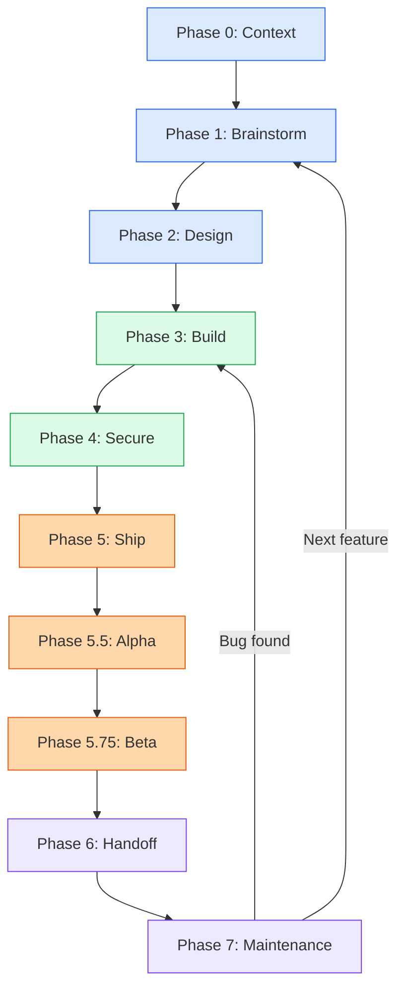

# riftkit

> **298 Skills** | **19 Agents** | **39 Commands** | **39 Rules** | **60+ Docs** | **25 Workflows** | **Zero Fluff**

AI assistants write great code but lack process discipline -- they skip architecture reviews, forget security audits, and never write migration runbooks. This framework gives them structured skills, automated agents, and slash commands for every phase of development, from first brainstorm through production maintenance.

---

## Why This Exists

Every AI coding assistant shares the same blind spot: it optimizes for the task in front of it. Ask it to build a feature and it will happily write code without a spec, skip threat modeling, deploy without a rollback plan, and move on to the next prompt. The result is software that works today and breaks tomorrow.

riftkit fills the gap with 298 skills that encode real engineering process -- architecture decomposition, test strategies, compliance checklists, deployment runbooks, post-launch observability, and everything in between. Each skill is a standalone Markdown file the AI reads on demand, so it knows not just *what* to build but *how* to build it responsibly.

On top of the skills sits an automation layer: 19 specialized agents that handle code review, security scanning, documentation updates, and build-error resolution; 39 slash commands that invoke those agents and skills from the CLI; and 6 event-driven hooks that enforce formatting, type-checking, and changelog discipline without you lifting a finger.

---

## Quick Start

```bash
# Clone and copy to your project
git clone https://github.com/nickcarmonadigital/riftkit.git
cp -r riftkit/.agent ./your-project/
```

Your AI assistant will automatically detect and use these skills.

**Global install** (available in every project):

```bash
cd riftkit/.agent
bash install.sh
```

**Joining an existing project?** See [EXISTING_PROJECT_GUIDE.md](EXISTING_PROJECT_GUIDE.md) for the inherit/adopt workflow.

**Choosing a project type?** See [BLUEPRINT_GUIDE.md](BLUEPRINT_GUIDE.md) for 50+ starter templates across 9 categories.

New here? Start with [.agent/GETTING_STARTED.md](.agent/GETTING_STARTED.md).

---

## The Lifecycle

Every project follows the same ten-phase path from idea to production. Phases can be skipped or revisited as needed -- a bug fix might jump straight to Build, while a greenfield product walks the full arc.



Full phase-by-phase reference with every skill mapped to its phase: [MASTER-LIFECYCLE.md](MASTER-LIFECYCLE.md).

---

## What's Inside

### Skills (298)

The skill library covers the entire development lifecycle. Each skill is a self-contained Markdown file with trigger commands, step-by-step process, and a completion checklist.

| Category | Representative Skills |
|----------|----------------------|
| **Context (23)** | `new_project`, `project_context`, `codebase_navigation`, `architecture_recovery` |
| **Brainstorm (14)** | `idea_to_spec`, `client_discovery`, `proposal_generator`, `competitive_analysis` |
| **Design (24)** | `atomic_reverse_architecture`, `feature_architecture`, `deployment_modes`, `schema_standards` |
| **Build (93)** | `spec_build`, `code_review`, `ui_polish`, `observability`, `api_design`, `docker_development` |
| **Secure (40)** | `security_audit`, `e2e_testing`, `unit_testing`, `performance_testing`, `tdd_workflow` |
| **Ship (23)** | `infrastructure_as_code`, `db_migrations`, `ci_cd_pipeline`, `legal_compliance` |
| **Alpha (10) / Beta (13)** | `error_tracking`, `health_checks`, `qa_playbook`, `product_analytics`, `feedback_system` |
| **Handoff (14)** | `feature_walkthrough`, `api_reference`, `user_documentation`, `disaster_recovery` |
| **Maintenance (13)** | `ssot_update`, `documentation_standards`, `dependency_management`, `continuous_learning` |
| **Toolkit (31)** | `content_waterfall`, `personal_brand`, `ceo_brain`, `ai_tool_orchestration`, `strategic_compact` |

### Agents (19)

Specialized AI subagents that handle focused tasks autonomously. See [.agent/agents/README.md](.agent/agents/README.md) for full documentation.

| Agent | What It Does | Invoke Via |
|-------|-------------|------------|
| `planner` | Decomposes features into implementation plans | `/plan` |
| `architect` | Designs system architecture and data models | `/plan` |
| `code-reviewer` | Reviews code for quality, patterns, and bugs | `/code-review` |
| `security-reviewer` | Audits code for OWASP vulnerabilities | manual |
| `tdd-guide` | Drives test-first development cycles | `/tdd` |
| `build-error-resolver` | Diagnoses and fixes build/compile failures | `/build-fix` |
| `e2e-runner` | Writes and executes end-to-end browser tests | `/e2e` |
| `doc-updater` | Keeps documentation in sync with code changes | `/update-docs` |
| `refactor-cleaner` | Identifies and executes safe refactors | `/refactor-clean` |
| `database-reviewer` | Reviews schema design, queries, and migrations | manual |
| `go-reviewer` | Go-specific code review and idiom checks | `/go-review` |
| `go-build-resolver` | Resolves Go build and module errors | `/go-build` |
| `python-reviewer` | Python-specific code review and lint checks | `/python-review` |
| `brainstorm-agent` | Brainstorm and ideation facilitation | manual |
| `compliance-agent` | Compliance review and audit | `/compliance-check` |
| `framework-router` | Route requests to correct skills and agents | automatic |
| `security-agent` | Security-focused analysis and review | `/security-audit` |
| `ship-agent` | Deployment and shipping operations | `/deploy` |
| `sre-agent` | SRE practices and reliability engineering | manual |

### Commands (39)

Slash commands give you one-step access to skills and agents from the Claude Code CLI. See [.agent/commands/README.md](.agent/commands/README.md).

| Category | Commands |
|----------|----------|
| **Lifecycle phases** | `/0-context` `/1-brainstorm` `/2-design` `/3-build` `/4-secure` `/5-ship` `/6-handoff` `/7-maintenance` |
| **Code quality** | `/code-review` `/tdd` `/build-fix` `/e2e` `/verify` `/test-coverage` `/refactor-clean` |
| **Planning** | `/plan` `/new-project` `/idea-to-spec` `/architecture` |
| **Operations** | `/checkpoint` `/eval` `/learn` `/evolve` `/orchestrate` `/multi-execute` |
| **Releases** | `/alpha` `/beta` `/launch` |
| **Toolkit** | `/debug` `/observability` `/age-commission` `/content-production` |

### Blueprints (50+ project types)

The blueprint library provides starter context and architecture decisions for common project types, organized into nine categories.

| Category | Examples |
|----------|----------|
| **Web & Apps** | Full-stack app, SaaS, landing page, PWA |
| **Games** | Unity, Unreal, Godot, browser game |
| **Trading & Finance** | Algo trading bot, DeFi protocol, payment platform |
| **Web3 & Blockchain** | Smart contracts, NFT marketplace, DAO tooling |
| **AI & ML** | ML pipeline, LLM app, computer vision, RAG system |
| **Hardware & IoT** | Embedded firmware, home automation, robotics |
| **Automation & DevOps** | CI/CD platform, infrastructure tool, CLI utility |
| **Plugins & Extensions** | VS Code extension, browser extension, Shopify app |
| **Data & Analytics** | Data pipeline, dashboard, ETL framework |

Full catalog: [BLUEPRINT_GUIDE.md](BLUEPRINT_GUIDE.md)

### Rules (39) + Hooks (6)

Thirty-nine always-on coding rules enforce consistent style and safety across seven language tracks: common (9), TypeScript (5), Python (5), Go (5), Java (5), Rust (5), and Swift (5). Six event-driven hooks handle session lifecycle, post-edit formatting, type-checking, and console.log detection automatically.

---

## Guides

The framework ships with focused guides for different workflows and audiences.

| Guide | What It Covers |
|-------|---------------|
| [MASTER-LIFECYCLE.md](MASTER-LIFECYCLE.md) | Full phase-by-phase reference with every skill mapped |
| [CLIENT_LIFECYCLE_GUIDE.md](CLIENT_LIFECYCLE_GUIDE.md) | Client project meta-workflow (discovery through handoff) |
| [BLUEPRINT_GUIDE.md](BLUEPRINT_GUIDE.md) | 50+ project type templates with starter context |
| [EXISTING_PROJECT_GUIDE.md](EXISTING_PROJECT_GUIDE.md) | Inherit or join an existing codebase |
| [.agent/GETTING_STARTED.md](.agent/GETTING_STARTED.md) | 5-minute setup and first commands |

---

## Example Usage

```
You: /plan I need a user dashboard with analytics

AI: [Creates structured implementation plan with architecture, milestones, and task breakdown]

You: /tdd dashboard-api

AI: [Drives test-first development for the dashboard API endpoints]

You: /build-fix

AI: [Diagnoses and fixes any build errors encountered]

You: /code-review

AI: [Reviews the implementation for quality, patterns, and potential issues]
```

---

## Project Structure

```
.
├── README.md                  # You are here
├── MASTER-LIFECYCLE.md        # Full lifecycle reference
├── CLIENT_LIFECYCLE_GUIDE.md  # Client project meta-workflow
├── BLUEPRINT_GUIDE.md         # 50+ project type templates
├── EXISTING_PROJECT_GUIDE.md  # Inherit/join existing codebase
└── .agent/
    ├── GETTING_STARTED.md     # 5-minute setup guide
    ├── install.sh             # Global installer (copies to ~/.claude/)
    ├── skills/                # 298 skill folders (organized by phase)
    ├── agents/                # 19 specialized AI subagents
    ├── commands/              # 39 slash commands
    ├── rules/                 # 39 coding rules (common + 6 languages)
    ├── hooks/                 # Event-driven automations
    ├── blueprints/            # 50+ project type starter templates
    ├── contexts/              # Dynamic system prompts (dev/review/research)
    ├── scripts/               # Node.js utilities (hooks, CI, lib)
    ├── schemas/               # JSON validation schemas
    ├── examples/              # 6 CLAUDE.md project templates
    ├── mcp-configs/           # MCP server integration configs
    ├── workflows/             # 25 workflow definitions
    └── docs/                  # 60+ reference guides + templates
```

---

## Skill Format

Every skill follows the same Markdown structure so the AI can parse them consistently:

```markdown
---
name: Skill Name
description: What this skill does
---

# Skill Name

## TRIGGER COMMANDS
[Commands to activate]

## When to Use
[Situations where this applies]

## The Process
[Step-by-step instructions]

## Checklist
[Completion criteria]
```

---

## Contributing

1. Fork the repo
2. Create a skill folder: `.agent/skills/{phase}/{skill_name}/SKILL.md` (choose the correct phase directory for your skill)
3. Follow the skill format above
4. Submit a PR

---

## License

MIT License - Use freely.
